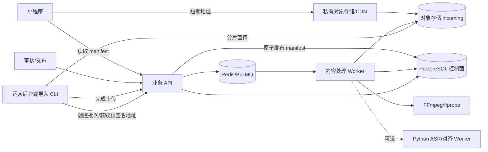

# 听阅：批量音频与字幕导入架构 v1

> 日期：2026-09-24
> 状态：建议基线，等待 B-01 人工确认
> 适用范围：大量音频、字幕、正文、词表、Quiz 与封面的导入、处理、审核和发布

## 1. 设计结论

后端必须从第一版就把“业务 API”和“媒体处理”拆开：

- PostgreSQL 只保存作品、版本、资产元数据、任务状态和审计记录，不保存音频或大字幕文件本体；
- 浏览器或导入 CLI 通过预签名地址把文件直接分片上传到对象存储，API 服务器不代理整文件；
- 上传完成后由队列触发独立 Worker，执行校验、探测、转码、字幕解析、对齐检查、哈希和 manifest 生成；
- 处理结果先进入待审核区，只有内容审核与发布门槛通过后才原子切换为可发布版本；
- 每个任务可重试、可追踪、可取消，失败文件进入隔离区或死信队列，不阻塞同批其他文件；
- 所有资产以不可变版本和 SHA-256 标识，禁止静默覆盖同一内容版本。

这套设计允许首版只在本机运行，同时保留未来迁移到云对象存储、托管 PostgreSQL、托管 Redis 和 CDN 的路径。

## 2. 建议技术基线（待确认）

| 层 | 建议 | 选择理由 |
| --- | --- | --- |
| API | Node.js 24 LTS、TypeScript、Fastify | 与现有前端 JavaScript 接近；契约、校验和异步 I/O 成本低 |
| 数据库 | PostgreSQL 16 或团队已验证的更新稳定版 | 事务、约束、JSONB、迁移和审计能力适合内容控制面 |
| 队列 | Redis 7 + BullMQ | 支持延迟、重试、并发限制、任务进度和死信处理；本机部署简单 |
| 对象存储 | local/dev 使用 MinIO；应用通过通用 S3 SDK 访问，生产使用 S3 兼容适配层 | 支持预签名、分片、版本化、生命周期和云厂商替换 |
| 音频处理 | FFmpeg + ffprobe 独立进程 | 探测时长/编码、响度检查、转码、波形和分段均可复现 |
| 字幕处理 | TypeScript 解析/校验；需要 ASR 或强制对齐时调用 Python Worker | 日常格式校验保持轻量，计算密集型能力可以单独扩容 |
| 契约 | OpenAPI 3.1 + JSON Schema | X/B 使用固定契约版本联调 |
| 部署 | Docker Compose 用于 local/dev/test；生产形态后续按云厂商冻结 | API、Worker、PostgreSQL、Redis、MinIO 可独立扩缩容 |

生产云厂商、地域、预算、CDN 和密钥服务仍需项目负责人确认；这些输入不阻塞本地架构、契约和测试实现。

## 3. 服务边界



- API 是控制面：鉴权、批次、上传会话、状态、审核和发布。
- Worker 是数据面处理器：不得对外暴露业务端口，不持有超出所需前缀的对象存储权限。
- 小程序只读取已发布资产，不得读取 `incoming`、`quarantine` 或 `processing`。

## 4. 对象存储布局与生命周期

建议使用逻辑前缀或独立 bucket：

- `incoming/`：已上传但尚未校验；
- `quarantine/`：类型、恶意文件或内容校验失败；
- `processing/`：Worker 中间产物，不对客户端开放；
- `ready/`：技术处理通过、等待人工审核；
- `published/`：审核和发布门槛通过的不可变资产；
- `rejected/`：人工驳回但按保存期保留的证据。

建议对象 key：

```text
{stage}/{workId}/{pieceId}/v{contentVersion}/{assetType}/{sha256}.{ext}
```

规则：

1. 原始文件和发布文件分别保存，禁止覆盖原始文件。
2. 数据库只保存 bucket、objectKey、ETag、SHA-256、字节数、MIME、时长和处理状态。
3. `processing/` 中间文件设置自动清理周期；`published/` 开启版本化或等价保护。
4. CDN 只指向 `published/`，回滚通过 manifest 切换版本，不改写旧对象。
5. 未完成分片上传、失败中间产物和过期预签名会话由定时清理任务回收。

## 5. 批量导入状态机

批次与单文件分别记录状态，避免一个坏文件让整批无法定位：

```text
DRAFT -> UPLOADING -> UPLOADED -> VALIDATING -> PROCESSING
      -> NEEDS_REVIEW -> READY -> PUBLISHED

任意处理中状态 -> FAILED / REJECTED / CANCELLED
FAILED -> RETRYING -> VALIDATING 或 PROCESSING
```

- 批次可以是 `PARTIAL_FAILED`，但同一 piece 的版本必须整体成功或整体不发布。
- 同一 `pieceId + contentVersion` 同时只能有一个活动发布事务。
- `PUBLISHED` 必须由显式审核/发布动作触发，Worker 不得自行绕过 `publishable:false`。

## 6. 导入控制面 API

首版接口放在管理员命名空间，只向受控运营身份或导入 CLI 开放：

- `POST /api/v1/admin/ingestion-batches`：创建批次和声明文件清单；
- `POST /api/v1/admin/upload-sessions`：创建预签名分片上传会话；
- `POST /api/v1/admin/upload-sessions/:uploadSessionId/complete`：提交分片列表并完成上传；
- `POST /api/v1/admin/ingestion-batches/:batchId/finalize`：确认本批文件齐全并进入处理队列；
- `GET /api/v1/admin/ingestion-batches/:batchId`：读取批次、文件和任务进度；
- `POST /api/v1/admin/ingestion-jobs/:jobId/retry`：对可重试失败重新入队；
- `POST /api/v1/admin/ingestion-batches/:batchId/cancel`：停止尚未开始的任务；
- `POST /api/v1/admin/content-versions/:contentVersionId/publish`：审核门槛满足后原子发布；
- `POST /api/v1/admin/content-versions/:contentVersionId/rollback`：切回已存在的安全版本。

每个创建、完成、重试和发布请求都必须带幂等键。预签名地址短时有效，只允许指定 key、大小范围、MIME 和校验值。

## 7. 数据模型

除 `works`、`pieces` 和 `content_assets` 外，首版增加：

- `ingestion_batches`：批次、来源、操作者、状态、总数、成功/失败数和时间；
- `ingestion_items`：声明文件、所属 piece、资产类型、预期大小/哈希和处理结果；
- `upload_sessions`：object key、multipart upload ID、过期时间和完成状态；
- `processing_jobs`：任务类型、状态、尝试次数、下一次重试、Worker 和错误码；
- `processing_artifacts`：原始文件、中间产物和最终产物的关系；
- `content_versions`：版本、manifest hash、审核状态、发布状态和回滚来源；
- `content_reviews`：审核人、门槛、结论、证据和时间；
- `audit_events`：上传、重试、驳回、发布和回滚的不可抵赖审计摘要。

约束：

- `content_assets(piece_id, content_version, asset_type)` 唯一；
- `ingestion_items(batch_id, client_file_id)` 唯一；
- `processing_jobs(job_type, idempotency_key)` 唯一；
- 同一个 SHA-256 可复用物理对象，但必须为每个逻辑资产保留独立引用和审计；
- 任务错误只保存受控错误码和脱敏摘要，不把字幕全文、token、密钥或预签名地址写入普通日志。

## 8. Worker 处理流水线

### 8.1 通用步骤

1. 校验对象存在、大小、MIME、扩展名、SHA-256 和上传会话。
2. 做文件头检测与安全扫描；异常文件移入 `quarantine/`。
3. 以任务幂等键抢占处理权，重复消息直接返回已有结果。
4. 生成受控中间产物，记录工具版本、参数、输入/输出哈希和耗时。
5. 成功后写 `ready/`，失败按错误类别重试或进入死信队列。

### 8.2 音频

1. 用 ffprobe 获取容器、编码、采样率、声道、码率和精确时长。
2. 拒绝损坏、时长异常、格式伪装、超限或无法解码的文件。
3. 保留原始文件；按已冻结配置生成客户端播放版本。
4. 检查峰值、响度、静音段和截断风险；超阈值转人工复核。
5. 生成时长、波形摘要和可选分段信息，供字幕检查及后台预览使用。

### 8.3 字幕

1. 支持冻结后的输入格式，例如 WebVTT、SRT 和项目 JSON；统一转 UTF-8 和内部 cue schema。
2. 校验 cue ID 唯一、开始时间递增、结束晚于开始、时间不越过音频、重叠规则和最小时长。
3. 规范换行与空白，但不擅自改写正文；原文和规范化结果都留哈希。
4. 生成词数、cue 数、覆盖区间和异常清单。
5. 需要 ASR/强制对齐时提交 Python Worker；结果只作为候选，不自动取代人工审核。

### 8.4 版本组装与发布

1. 确认该 piece 所需资产种类全部成功且版本一致。
2. 生成包含 object key、SHA-256、字节数、时长和契约版本的 manifest。
3. 运行内容包、交叉引用、Quiz cue、词表 token 和可发布门槛校验。
4. 在数据库事务中写入待审核版本；审核通过后原子更新当前发布指针。
5. 发布后再做 CDN 预热/失效；任何一步失败都不能出现半发布版本。

## 9. 重试、并发与容量

- 网络、对象存储 5xx、临时资源不足使用指数退避和随机抖动；
- 哈希不符、格式不支持、字幕越界属于不可自动重试错误；
- 每类任务设置独立并发，例如探测高并发、转码低并发，避免 CPU/内存被单批耗尽；
- 单个批次设置并发上限和公平队列，避免大批次饿死小批次；
- Worker 可水平扩容，但同一逻辑任务必须由幂等锁和唯一约束保证只提交一次结果；
- 死信任务必须可查看错误码、输入哈希、最后一次尝试和人工处置记录；
- 首版不承诺固定吞吐量，先以真实样本压测后冻结“每小时文件数、总 GB、单文件上限和目标处理时延”。

## 10. 监控与告警

至少监控：

- 上传创建/完成率、分片失败率、过期会话数；
- 队列深度、最老任务等待时长、重试数和死信数；
- 各处理阶段 P50/P95/P99 时长及 Worker CPU、内存、临时磁盘；
- 音频/字幕技术校验失败分布；
- incoming、processing、ready、published 的对象数和容量；
- 批次成功率、部分失败率、人工复核积压和发布时延；
- API、数据库、Redis、对象存储和 CDN 的可用性。

`requestId`、`batchId`、`itemId`、`jobId` 和 `contentVersionId` 必须能串起完整链路，但日志中不保留预签名 URL。

## 11. 备份与恢复

- PostgreSQL 做可恢复备份并演练时间点恢复；
- 对象存储开启版本化、生命周期和必要的跨域备份策略；
- Redis 队列不是内容事实来源，数据库必须能找出未完成任务并重新投递；
- 恢复演练包含“数据库恢复后重建队列”和“对象仍在但任务状态丢失”的对账；
- 发布指针与 manifest 在同一事务内恢复，避免客户端读取混合版本。

## 12. 验收与压测清单

1. 一次导入数百个音频/字幕文件，API 进程内存不随总文件体积线性增长。
2. 分片上传中断后能续传；过期会话不能继续写入。
3. 相同文件重复提交不重复处理或生成冲突资产。
4. 音频损坏、后缀伪装、哈希错误、字幕乱码、时间倒序/越界分别返回稳定错误码。
5. Worker 在处理一半时退出，任务可由其他 Worker 安全接管。
6. 毒性任务达到上限后进入死信队列，不无限重试。
7. 同一 piece 同一版本并发导入只能成功一个。
8. 批次部分失败时能精确重试失败项，不重复发布成功项。
9. 审核未通过时无法发布；发布中任一步失败时客户端仍读取旧完整版本。
10. 回滚能切回旧 manifest，CDN 和数据库版本一致。
11. 清理任务不会删除被内容版本引用的对象。
12. 达到压测目标时记录吞吐、时延、CPU、内存、临时磁盘和对象存储成本估算。

## 13. 当前人工确认点

开始建立 `backend/` 前，需要项目负责人确认：

1. 是否采用“Node.js/TypeScript/Fastify + PostgreSQL + Redis/BullMQ + MinIO/S3 兼容对象存储 + FFmpeg + 可选 Python Worker”的建议基线；
2. B 长期分支名称；建议 `backend/v1`；
3. 首批实际导入规模：文件数、总容量、最大单文件、常见音频/字幕格式；
4. 生产云供应商、地域、预算和运维负责人可后补，但进入生产部署前必须冻结。
