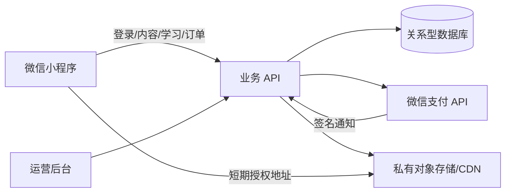

# 听阅小程序正式产品实施计划 v1.1

> 版本：v1.1  
> 更新日期：2026-09-23
> 文档状态：**当前执行基线**  
> 当前阶段：阶段 0 进行中，发布结论为 **NO-GO**  
> 下一执行任务：`C-03 外部权利审核签署`；客户端补齐 `X-02` 真机后台/锁屏和 `X-05` 体验版/正式版双端验收

## 0. 文档定位与执行规则

本文件是听阅小程序后续产品、技术、内容、验收和发布工作的统一主计划。开发任务必须对应本文件中的稳定任务 ID；完成后同步任务状态、证据位置和检查结果。未达到完成判定的任务不得标记为完成。

文档优先级如下：

1. 本实施计划与已经签署的阶段决策；
2. `docs/阶段0核验表-v1.0.md`、`docs/内容权利台账-v1.0.md` 等专项台账；
3. 技术架构、页面说明、内容管道设计等专项设计文档；
4. 历史产品规划和演示说明。

若专项文档与本计划冲突，以本计划和最新签署决策为准；未冲突的专项实现细节继续有效。本计划不虚构上线日期、人员和预算，缺少真实输入时使用“待指定/待确认”。

### 0.1 状态定义

| 状态 | 含义 |
| --- | --- |
| `TODO` | 尚未开始，前置条件已记录 |
| `READY` | 前置条件满足，可以执行 |
| `IN_PROGRESS` | 正在实施，有明确负责人或当前动作 |
| `PARTIAL_DEVICE_PENDING` | 代码与自动验收完成，但任务要求的真机证据尚缺 |
| `BLOCKED` | 缺少外部输入、资质或人工结论 |
| `DONE` | 完成判定全部通过，证据已记录 |
| `N/A` | 经负责人确认不适用，并记录理由 |

### 0.2 变更规则

- 产品范围、阶段顺序、数据权威或发布门槛变化时升级文档版本，并写入修订记录。
- 普通任务进度变化直接更新任务表、`开发进度与待办.md` 和对应证据。
- 代码、文档、测试结果与计划状态不一致时，以可复核事实为准，并立即修正文档。
- 私钥、APIv3 密钥、证书、身份证件和合同原件不得提交到 Git；计划中只记录受控位置、日期、核验人和结论。

---

## 1. 当前基线

截至 2026-09-23，仓库已经具备原生微信小程序前端、浏览器交互预览、内容管道和自动检查，但没有正式后端、真实支付、生产数据同步或上线资格。

| 范围 | 当前事实 | 结论 |
| --- | --- | --- |
| 产品模式 | 单一源码生成正式/Demo 两套可复现产物；默认配置只加载正式产物，正式包只含 Peter Rabbit 且物理排除 Demo 路由、模块、固定验证码、缓存键与旧内容 | 自动审计、静态检查、浏览器回归和微信开发版验证通过；体验版/正式版仍待双端验收 |
| 内容 | Peter Rabbit 首发候选包为 `contentVersion:1`，含 322.026 秒真实音频、59 条播放字幕、358 个正式词条和 10 道固定双语 Quiz | C-04 已完成授权 AI 辅助全量审核，X-03 已完成 906 个 token 的词卡接线；权利与整体人工门槛仍开，`publishable:false` |
| 字幕审核 | 审核人 `wzx` 已完整听完全文并签署 28/28 个裁决；O1/O2 已按录音恢复；校验、应用和客户端导出通过 | `subtitleReviewComplete:true`，字幕子门槛已关闭 |
| 词汇 | 371 个审核单元已完成经 `wzx` 授权的 AI 辅助全量审核；13 组按上下文拆义，Benjamin 与 McGregor’s 作为专名排除；形成 358 个正式义项、覆盖 906 个可点击 token | `vocabularyApproved:true`；审核方式与 12 个低置信度复核项已归档；整体人工完成门槛和发布门槛仍关闭 |
| 旧内容 | 4 本旧书、7 章音频已导入 `legacy-listen-read` | 仅 Demo/待审核，不是正式商品 |
| 自动检查 | `npm test` 57/57；正式产物 10 路由约 559 KiB、Demo 产物 13 路由约 2447 KiB；双构建 SHA-256 可复现；内容结构检查通过 10 本；两套生成产物的浏览器回归通过，含真实音频跨页会话、拖尾拦截、重启断点和 X-04 可信边界 | 仅证明当前工程自洽，不代替整体人工审核、真机和业务资质 |
| 正式后端 | 无服务端工程、数据库迁移、对象存储或部署配置 | 尚未开始 |
| 阶段 0 | `PASS 0 / PARTIAL 3 / BLOCKED 11 / N/A 0` | **NO-GO** |

当前人工与开发任务双轨推进：

- 项目负责人补齐账号、支付、权利、隐私、经营地区、负责人和预算等阶段 0 证据。
- 开发侧继续完成内容审核、播放器、词卡、Quiz、内容包、测试和后端接口设计。
- 阶段 0 未 `GO` 前，不开放真实收款、不启用生产支付、不发布未获批准的内容。

---

## 2. 正式首版范围

### 2.1 首版目标

以 Peter Rabbit 为唯一正式内容候选，打通：

`内容审核 → 听读 → 同步字幕 → 点词 → Quiz → 阅读进度 → 登录同步 → 购买权益`

首版按作品（work）单本购买，每个作品配置免费试读 piece，不做会员订阅。具体商品、价格、退款规则、币种和经营地区必须在阶段 0 冻结后进入服务端商品表。

### 2.2 首版包含

- Home / Recent / Me 三个主 Tab；
- Peter Rabbit 正式内容候选及其审核记录；
- 后台音频、逐句字幕、点词、Quiz、收藏、最近阅读和可靠收听记录；
- 微信身份、跨设备进度、生词和测验同步；
- 服务端商品、订单、权益、查单补偿、退款和对账；
- 内容运营的草稿、审核、预览、发布和回滚；
- Android 与 iPhone 分别验证后的可用购买或权益路径。

### 2.3 首版不包含

- 实体借阅、预约、馆员工作台和真实库存；
- 优惠券、邀请奖励和演示购买；
- 固定验证码或本机模拟登录；
- 儿童多档案、订阅会员和付费内容离线下载；
- 未完成人工审核或权利审批的旧书；
- 根据标题猜测 ISBN、出版社、页数、分级或版权状态。

这些能力可保留在显式 Demo 中，但不得进入正式模式、正式数据或真实权益。

---

## 3. 产品与内容原则

1. 免费内容保持免费，不以“购买”文案误导；未冻结商品不得展示真实价格。
2. 家长微信账号持有订单与权益；首版一个账号一份阅读记录，数据模型为家庭和多阅读者预留扩展字段。
3. 价格、支付状态、权益、内容发布状态和审核状态以服务端为权威，客户端不得提交或覆盖。
4. 本机演示购买、优惠券、邀请状态和固定验证码不得转为真实权益。
5. 字幕跟随录音实际朗读；标准原文独立保留。机器建议不是人工批准。
6. 首篇内容必须完整试听；重点问题逐项确认，不能只审核机器标记片段。
7. 音频、字幕、词表、Quiz 和资源使用稳定 `pieceId + contentVersion` 成套发布；任一发布资产变化必须升版。
8. 内容始终经过“源材料 → 机器处理 → 人工审核 → QA → 预览 → 发布/回滚”，不得为通过检查静默篡改源材料。

---

## 4. 实施任务与顺序

### 4.1 内容闭环 C

| ID | 状态 | 任务 | 完成判定与证据 |
| --- | --- | --- | --- |
| C-01 | `DONE` | Peter Rabbit 字幕人耳审核 | 审核人 `wzx` 已完整听完全文；28 个决策全部确认；校验和应用通过；`subtitleReviewComplete:true`；审核记录可追溯 |
| C-02 | `DONE_AI_ASSISTED` | Peter Rabbit 词汇编辑审核 | 371 个审核单元已完成 `wzx` 授权的 AI 辅助全量审核；原创双语释义、上下文拆义、全量校验与应用均通过；358 个正式义项覆盖 906 个 token；未声称 `wzx` 本人逐项人工检查 |
| C-03 | `READY_FOR_EXTERNAL_REVIEW` | Peter Rabbit 权利审批 | 中国大陆公开商业使用证据包、原创替换、完整许可说明和签署模板已完成；仍待实际外部审核人签署并落实限制，故未 `DONE` |
| C-04 | `DONE_AI_ASSISTED` | 正式元数据与 Quiz 终审 | 权威 ID 已冻结为 `peter-rabbit` / `peter-rabbit-01`；移除无来源 Level/Pages；Edition 与 Series 分离；10 道固定双语题逐题绑定正文 cue；元数据、Quiz、字幕、词表、音频、封面纳入 `contentVersion:1` 哈希清单；审核方式如实记录，未声称人工终审 |
| C-05 | `TODO` | 内容包发布门槛 | 字幕、词汇、权利、元数据和 Quiz 全部通过；QA 无阻断；才允许 `publishable:true` |

执行顺序：`C-01` 已完成；`C-02` 与 `C-04` 已以授权 AI 辅助方式完成相应子门槛；`X-03` 正式词卡接线和 `X-01` 播放器跨页状态已完成；`X-02` 代码与自动验收完成，等待真机后台/锁屏证据；C-03 已达到 `READY_FOR_EXTERNAL_REVIEW`，等待外部签署。C-03、整体人工与其他阻断关闭后才能执行 C-05 发布放行。

### 4.2 客户端闭环 X

| ID | 状态 | 任务 | 完成判定与证据 |
| --- | --- | --- | --- |
| X-01 | `DONE` | 播放器跨页状态 | 全局播放会话统一持有篇目、播放/暂停、位置、倍速、循环和错误状态；页面只订阅快照并在隐藏/卸载时退订；跨页继续播放、返回接管实时位置、用户暂停不自动恢复；系统媒体事件、词卡/Quiz 暂停意图及并发本机写入已测试；证据见当前 57/57 单测与 `artifacts/production/audio-test.json` |
| X-02 | `PARTIAL_DEVICE_PENDING` | 断点与可靠完成判定 | 已实现游标与可信断点分离、跨重启暂停恢复、唯一收听区间合并、真实墙钟计时、版本失效和异常后台间隔拒绝；完成必须满足自然结束、唯一覆盖率至少 90% 且尾部 3 秒已听；拖尾测试与浏览器重启测试通过。仍需按 `docs/X-02真机验收记录-template.md` 在至少一台微信真机验证后台、锁屏和系统控制后才可 `DONE` |
| X-03 | `DONE` | 正式点词体验 | 358 个审核义项映射全文 906 个可点击 token；使用 token 的上下文 `vocabKey` 显示义项；播放中打开词卡暂停，关闭后仅在原先播放时续播；映射和意图已纳入自动测试 |
| X-04 | `DONE` | Quiz、报告和排行边界 | 题包身份随生成模块输出；attempt 保存版本、题目、逐题选择、起止时间及验证状态；本机反馈明确标为 `local_unverified`；旧记录保留但不进入新统计；报告每篇只取最新兼容记录，至少 6 篇才显示早期/近期趋势；排行榜仅保留 7-Day / All-Time 并显示真实不可用状态；服务端判题契约见 `docs/Quiz-attempt-API-v1.md`，57/57 单测和浏览器全流程通过 |
| X-05 | `PARTIAL` | 正式/Demo 隔离 | 单一源码可重复生成正式/Demo 两套产物；默认 `project.config.json` 仅加载正式产物，独立 `project.demo.config.json` 仅用于 Demo；正式产物物理移除 Demo 路由、模块、固定验证码、开发缓存键和旧书，仅保留 Peter Rabbit；生产依赖闭包、禁用文本、双产物静态/浏览器回归及 SHA-256 可复现检查通过，证据见 `artifacts/build/X-05-release-audit.json`。体验版、正式版 Android/iPhone 版本号、截图与真机证据仍缺，故不标记 `DONE` |

字幕审核、`X-03`、`X-01` 与 `X-04` 已完成；`X-02` 自动验收完成但等待真机证据；`X-05` 的构建隔离和自动验收已完成，等待体验版/正式版双端证据，并继续作为每次构建的回归门槛。服务端判题实现属于后端阶段，不由本机结果替代。

### 4.3 后端基础 B

| ID | 状态 | 任务 | 完成判定与证据 |
| --- | --- | --- | --- |
| B-01 | `BLOCKED` | 环境与技术选型 | 云供应商、地域、预算、负责人和 dev/test/prod 边界已确认 |
| B-02 | `TODO` | 数据库与迁移 | schema、索引、迁移、种子数据、备份和恢复演练可重复 |
| B-03 | `TODO` | 微信登录会话 | `wx.login` code 只在服务端换身份；密钥不进客户端；会话撤销和过期明确 |
| B-04 | `TODO` | 内容 API 与资源鉴权 | 目录、manifest、版本和授权资源可获取；未授权不可直访付费资源 |
| B-05 | `TODO` | 日志、监控与运营后台基础 | 登录、内容、同步和发布操作可审计；错误有告警与负责人 |

`B-01` 的外部输入可与内容、客户端任务并行准备；未确认生产账号和地域前，只允许本地接口设计与测试环境方案。

### 4.4 学习同步 S

| ID | 状态 | 任务 | 完成判定与证据 |
| --- | --- | --- | --- |
| S-01 | `TODO` | 一次性本机学习数据导入 | 仅导入进度、生词和 Quiz；迁移 ID 幂等；演示权益和券明确排除 |
| S-02 | `TODO` | 日常同步队列 | 离线可恢复；重试不重复；服务端返回版本和时间戳 |
| S-03 | `TODO` | 冲突合并 | 进度、可信听读时长、生词删除和 Quiz 历史各有确定规则 |
| S-04 | `TODO` | 双设备验收 | 交替使用、退出、重装、弱网和重复提交均保持一致 |

### 4.5 真实交易 P

真实交易只在阶段 0 形成 `GO` 决策后实施或启用。

| ID | 状态 | 任务 | 完成判定与证据 |
| --- | --- | --- | --- |
| P-01 | `BLOCKED` | 商品与订单 | 商品、试读、价格、上下架和退款规则冻结；客户端只传 `work_id` |
| P-02 | `BLOCKED` | 微信支付下单与回调 | 服务端下单；回调验签解密并核对商户号、AppID、订单号、金额和状态 |
| P-03 | `BLOCKED` | 权益与查单补偿 | 只有服务端确认支付后授权；客户端 success 不直接解锁；延迟通知可恢复 |
| P-04 | `BLOCKED` | 退款与权益回收 | 退款终态、权益状态、例外处理和审计一致 |
| P-05 | `BLOCKED` | 对账、告警和客服 | 微信账单、订单、权益和退款每日核对；差异有人工处理入口 |

### 4.6 发布 R

| ID | 状态 | 任务 | 完成判定与证据 |
| --- | --- | --- | --- |
| R-01 | `BLOCKED` | 双端真机基线 | Android/iPhone 的登录、后台/锁屏音频、弱网、系统打断和隐私授权分别通过 |
| R-02 | `BLOCKED` | 安全与隐私审查 | 字段、目的、保存期、第三方、注销/删除、未成年人和家长付费提示与实际一致 |
| R-03 | `BLOCKED` | 全链路预演 | “试读→登录→购买→续读→换设备→退款”及失败恢复均通过 |
| R-04 | `BLOCKED` | 灰度、监控与回滚 | 指标、阈值、值守、客服、发布和回滚手册就绪 |
| R-05 | `BLOCKED` | 提审与发布 | 阶段阻断全部关闭，项目负责人记录范围、日期和 `GO` 决策 |

---

## 5. 服务端权威与系统边界

- 小程序只保存短期会话、可恢复学习队列和允许缓存的免费资源。
- 付费正文与音频不完整打包进前端；服务端按用户、权益、piece 和版本鉴权。
- 免费试读可公开缓存；付费离线下载不在首版范围。
- 有效期、撤销和防批量抓取设可接受边界，不承诺绝对防复制。

### 5.1 核心数据

| 对象 | 核心字段 | 规则 |
| --- | --- | --- |
| `users` | user_id、微信标识、状态、创建时间 | 微信标识与业务主键分开；最小化存储 |
| `works` / `pieces` | 稳定 ID、版本、发布状态、免费/付费属性 | 购买按 work；进度、Quiz 和缓存按 piece |
| `content_assets` | piece、版本、存储 key、校验值、状态 | 音频、字幕、正文、词表和 Quiz 同版本发布 |
| `orders` | 业务单号、用户、作品、金额快照、微信交易号、状态 | 唯一业务单号；状态单向推进；通知幂等 |
| `entitlements` | 用户、作品、来源订单、状态、起止时间 | 唯一有效权益；退款按政策处理 |
| `reading_progress` | piece、位置、听读增量、完成状态、更新时间 | 只合并可信增量；拖尾不算完成 |
| `saved_words` | 用户、词条、收藏/删除版本和时间 | 按用户+词条去重；删除冲突规则明确 |
| `quiz_attempts` | 用户、piece、题目版本、答案、分数、时间 | 保留历史尝试，不覆盖高分 |

建议首批 API：`POST /session/wechat`、`GET /me`、`GET /works`、`GET /works/:id`、`GET /pieces/:id/manifest`、`PUT /me/progress/:pieceId`、`PUT/DELETE /me/words/:key`、`POST /me/quiz-attempts`、`POST /me/local-import`。交易 API 在 `P` 阶段补充并冻结正式契约。

---

## 6. 阶段 0 与上线前置关口

逐项状态和证据要求以 `docs/阶段0核验表-v1.0.md` 为准，至少包括：主体认证与类目、商户号和 AppID 绑定、双端数字内容收费适用性、交易类要求、商品与退款政策、内容权利、隐私与未成年人、云环境和数据地域、运营责任、正式/Demo 隔离及双端真机证据。

只有阶段 0 退出条件全部满足，项目负责人才可签署 `GO`。在此之前允许内测和非生产开发，但不得真实收款或正式发布内容。

---

## 7. 验收门槛

### 7.1 每个任务的完成定义

任务标记 `DONE` 必须同时具备：

- 对应任务 ID 和实现范围；
- 自动测试或人工验收记录；
- 失败、边界和恢复路径已验证；
- 文档、状态和实际代码一致；
- 没有通过关闭检查、伪造数据或降低门槛来“完成”任务；
- 产物已进入受控版本或证据位置。

### 7.2 发布阻断

支付资格或目标设备收费方式未确认；内容权利、字幕、词汇或元数据未通过；客户端可伪造支付态；未授权可直访付费资源；支付成功无恢复；无退款、客服、对账、监控或回滚；同步可能严重覆盖；正式/Demo 隔离或双端主路径失败；隐私政策与实际数据流不一致——任一存在均不得发布。

### 7.3 观测指标

登录成功率、内容资源错误率、音频启动耗时与卡顿率、同步失败率、下单成功率、支付确认成功率、支付到授权益延迟、账单差异数和退款处理时长。阈值在测试环境建立基线后冻结，发布首周每日复核。

---

## 8. 当前输入缺口与责任

| 输入/责任 | 当前状态 |
| --- | --- |
| 小程序管理员、主体认证和目标类目 | 待确认 |
| 商户号、AppID 绑定和支付权限 | 待确认 |
| Android/iPhone 收费路径结论 | 待确认 |
| 云供应商、地域、预算和运维负责人 | 待指定 |
| 正式商品、售价、试读和退款政策 | 待确认 |
| 内容与权利审核人 | 待指定 |
| 隐私、客服、退款、对账和故障负责人 | 待指定 |
| 目标经营地区和上线窗口 | 待确认 |

输入未明确前不得编造排期。负责人和证据到位后，在阶段 0 核验表记录结论，并为 `B/P/R` 阶段形成具体工期。

---

## 9. 当前下一步

1. `C-01` 已完成：审核人 `wzx` 完整听审并签署 28/28 个裁决，校验、应用和导出通过，正式字幕为 59 条。
2. `C-02` 已完成并应用：371 项经 `wzx` 授权的 AI 辅助全量审核形成 358 个正式义项；整体人工完成门槛继续保持关闭。
3. 将 C-03 证据包交给外部审核人，补齐姓名、机构、日期、中国大陆商业使用结论、证据 ID 和限制条件；运营主体成立前保持 `PENDING_ENTITY`。
4. `C-04` 已完成授权 AI 辅助全量审核；`X-03`、`X-01` 与 `X-04` 已完成。X-04 已冻结本机未验证记录、报告聚合和空排行榜边界，并定义服务端判题契约；`X-02` 仍需在至少一台微信真机验证后台、锁屏、系统暂停/恢复和可信时长后再标记 `DONE`。
5. 项目负责人并行关闭阶段 0 外部证据；形成 `GO` 后才进入真实交易实施与启用。

---

## 10. 修订记录

| 版本 | 日期 | 变更 |
| --- | --- | --- |
| v1.1 | 2026-09-21 | 确立为唯一主计划；同步当前状态；明确正式首版范围；增加稳定任务 ID、顺序、完成定义和证据规则；Peter Rabbit 字幕审核已完成；C-02 词汇审核工作台及开放来源证据已就绪，进入人工审核 |
| v1.1.1 | 2026-09-22 | C-02 在 `wzx` 明确授权下完成 AI 辅助全量审核并应用；记录真实审核方式；生成 358 个正式义项并保留整体人工、权利、元数据、Quiz 与发布门槛 |
| v1.1.2 | 2026-09-22 | C-03 完成公开证据整理和不明来源素材替换，状态推进到 `READY_FOR_EXTERNAL_REVIEW`；目标地区为中国大陆、用途为公开商业产品；外审签署和发布闸门继续关闭；C-04 转为 `READY` |
| v1.1.3 | 2026-09-22 | C-04 按 `wzx` 授权完成 AI 辅助全量审核；正式 ID、元数据、10 道 cue 证据题与 `contentVersion:1` 哈希清单落地；旧 `peter` 本机状态自动迁移；未声称人工终审，发布闸门继续关闭；开发侧转入 X-03 |
| v1.1.4 | 2026-09-22 | X-03 完成：358 个审核义项覆盖 906 个可点击 token，上下文拆义和词卡播放意图已接入并回归；发布闸门保持关闭；开发侧转入 X-01 |
| v1.1.5 | 2026-09-22 | X-01 完成：全局播放会话在页面切换时保持篇目、实时位置、播放状态与倍速；用户暂停不自动恢复，旧页面退订，系统媒体事件与并发本机更新纳入回归；开发侧转入 X-02 |
| v1.1.6 | 2026-09-23 | X-02 代码与自动验收完成：90% 唯一覆盖、自然结束和尾部 3 秒共同决定完成；重启从可信断点暂停恢复；倍速按真实墙钟计时；拖尾、异常后台间隔和版本变化均有回归。因缺少微信真机后台/锁屏证据，状态为 `PARTIAL_DEVICE_PENDING` |
| v1.1.7 | 2026-09-23 | X-04 完成：版本化 attempt、逐题选择与验证状态落地；旧记录不混入新版统计；每篇仅取最新兼容记录，6 篇后才显示趋势；移除虚构排行筛选、用户和名次；冻结 `POST /me/quiz-attempts` 服务端判题契约；自动检查提升至 53/53 |
| v1.1.8 | 2026-09-23 | X-05 自动化范围完成：单一源码生成可复现的正式/Demo 双产物；默认配置锁定正式产物，正式包物理移除 Demo 路由、模块、固定验证码、开发缓存键和旧内容；审计、双产物静态检查和浏览器回归通过，自动检查提升至 57/57。因缺少体验版/正式版 Android 与 iPhone 证据，状态保持 `PARTIAL` |
| v1.0 | 2026-09-18 | 建立正式产品商业闭环、阶段门槛和实施框架 |

## 参考文档

- `docs/阶段0核验表-v1.0.md`
- `docs/内容权利台账-v1.0.md`
- `docs/原生产品模式验收记录-2026-09-21.md`
- `docs/X-02真机验收记录-template.md`
- `docs/Quiz-attempt-API-v1.md`
- `听阅小程序-技术架构与需求总览-v1.2.md`
- `听阅小程序-页面设计与技术实现说明书-v1.0.md`
- `录音-字幕-点词内容管道设计-v1.0.md`
- `content/peter-rabbit/peter-rabbit-01/README.md`
- `content/legacy-listen-read/README.md`
