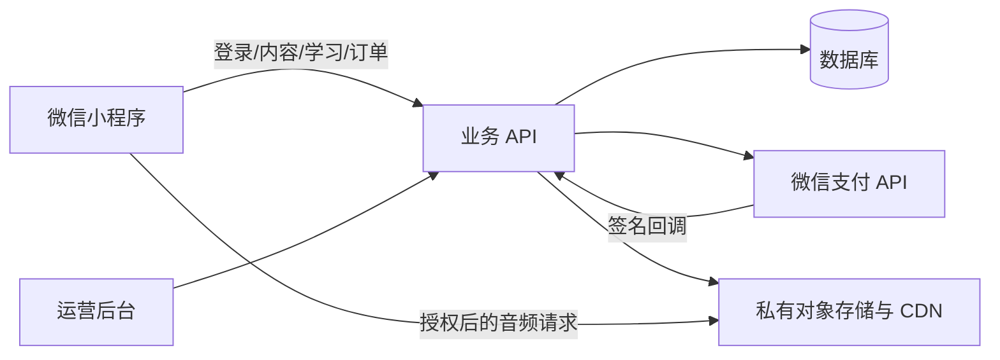

# 正式产品实施计划-移植版-v1.0

> 版本：v1.0 ｜ 2026-09-18
> 来源：`C:\demo11\docs\production-plan.md`（《芽芽听阅：从演示版到真实付费版实施计划》，2026-09-17）要点提炼与适配
> 定位：补 pipeline 缺失的商业闭环（支付/权益/同步/权利/运营），不覆盖现有数字闭环设计
> 状态：规划稿，待阶段 0 核验后排工期；不设未经确认的上线日期与固定预算

---

## 0. 与现文档的关系（必读，避免冲突）

| 本文件 | 现文档 | 关系 |
| --- | --- | --- |
| 支付/权益/同步/前置关口/验收 | `听阅小程序-技术架构与需求总览-v1.2.md` + `听阅小程序-页面设计与技术实现说明书-v1.0.md` | **增量补充**。v1.2 与页面说明书定义的纯数字闭环（Home / Recent / Me 三 Tab、无实体借阅、Quiz/报告/排行、piece 粒度、M1/M3/M5 闸门）**为准**，本文件不改其中任何需求与接口 |
| 内容管道细节 | `录音-字幕-点词内容管道设计-v1.0.md` | **复用不重复**。piece_id + contentVersion、source/work/dist/review 分层、自动 QA + 人工审核流程以管道设计为准；本文件只讲“发布状态以服务端为准、付费资源鉴权”等商业约束 |
| 实体借阅 | `听阅小程序-产品规划-v1.0.md` 中的借阅四 Tab、馆员工作台、预约/借出/归还 | **不在本计划范围内**。本计划遵循 v1.2“不做物理借阅”结论，不复活借阅需求、不引入 `reservations/loans` 借阅表 |
| 旧书商品清单 | 来源 plan 中的“三本原创短故事 + Oz 第一章” | **仅作 legacy 实例**。`content/legacy-listen-read/` 已导入四本旧书（7 章音频、78 条字幕，`publishable:false` 待权利与逐句复核），本文件不把该清单定为 pipeline 主线商品；主线仍是 Peter Rabbit（见 `content/peter-rabbit/`）。正式商品清单、售价、退款规则待阶段 0 冻结 |
| 定价/券包/邀请 | v1.2 §11 待决策、页面说明书 §1.3 待定 | **维持待定**。来源 plan 的“单本购买、无订阅、隐藏邀请券”采纳为首版原则（§1），但具体金额、券规则不搬运旧演示值（旧满 ¥12 减 ¥5、本机 `coupons/friendSimulated` 作废）；定价三选一仍待业务确认后填入服务端商品表 |

### 0.1 术语映射

| 来源 plan 用语 | 本项目用语 | 说明 |
| --- | --- | --- |
| 芽芽听阅、`modules/listen-read`（旧） | Tingyue、`miniprogram/modules/` + `modules/account|listen-read|physical-loan`（`physical-loan` 仅演示占位，不上线） | 旧 `services/{store,host,content,player}.js` 路径仅作来源备注，不作为本项目实现位置 |
| book / chapter | work（作品）/ piece（篇/章，独立发布单元） | 购买单位按 work，进度/Quiz/缓存/排行按 piece；ID 必须长期稳定（见 v1.2 §4） |
| 本机 `yaya-listen-read-v1`、`purchased`、`coupons` | 本机演示缓存（`README.md` 所述“仅本机、不跨设备”） | 迁移时学习数据可并，权益与券不可并（§3） |
| 内容版本 | `pieceId + contentVersion` 缓存键 | 音频/字幕/词表任一变更即升版，不混用（以管道设计为准） |

---

## 1. 首版原则（取自来源 §1，通用化后）

1. 按作品（work）单本购买，每作品第一篇试读；**不做会员订阅**。具体书目与正式售价由服务端商品表配置，阶段 0 冻结前不承诺。
2. 免费内容保持免费，不宣传为付费书。Oz 在整书完成前不出现“购买整本 Oz”文案；Peter Rabbit 按现有内容版本与权利结论发布。
3. 家长微信账号持有订单与权益；**首版一个账号一份阅读记录，儿童档案后置**。数据模型保留家庭/阅读者扩展字段（兼容产品规划 v1.0 §2“先单阅读者、模型预留二孩”），避免后续重构。
4. 阅读进度、生词、测验成绩跨设备同步；首次真实登录时合并本机学习数据（§3）。
5. 旧演示状态（本机模拟购买、邀请优惠券、固定验证码 `123456`）**不转为真实权益**；首版隐藏邀请与优惠券入口。
6. 真正下单、支付确认、解锁、退款处理、订单查询与对账均要可用；iPhone 与安卓的收费路径分别验证后再开对应端购买入口。

---

## 2. 服务端为权威（取自来源 §4.1–§4.2）

小程序保留现有页面与听读交互；新增一套服务端 API、关系型数据库、对象存储/CDN 与运营后台。云厂商不绑定，按现有账号、成本与团队能力定。小程序只拿短期会话凭证。

- 价格、支付状态、购书权益、内容发布状态**不可由客户端提交或覆盖**。付费正文与音频不完整打包进前端；走带有效期的鉴权访问，服务端按用户与 piece 鉴权。免费试读可走公开缓存。有效期、撤销、防批量抓取设可接受边界，不承诺绝对防复制。
- 免费章节可离线；付费章节离线作为后续独立设计，首版先保证弱网恢复与明确错误提示。

### 2.1 新增数据（仅支付/权益/同步增量，不含借阅）

现有 `books/pieces/cues/vocab/quiz/user_progress/user_vocab/user_favorite/ranking_cache/user_profile`（见 v1.2 §4、页面说明书 §5.10）保持不变，新增：

| 表/对象 | 核心字段 | 规则 |
| --- | --- | --- |
| `users` | 内部 user_id、微信标识、创建时间、状态 | 微信标识与业务主键分开；最小化存储 |
| `orders` | 业务单号、user_id、work_id、快照金额、微信交易号、状态、时间 | 唯一业务单号；状态单向推进、可幂等重放 |
| `entitlements` | user_id、work_id、来源订单、起止时间、状态 | 唯一有效权益；退款按规则处理 |
| `reading_progress` 扩展 | 在现有 `user_progress(progress_sec,listen_sec,completed,quiz_score)` 上加更新时间、设备版本 | 同 piece 多设备合并见 §3；听读时长只合并可信增量 |
| `saved_words` / `quiz_attempts` | 对应现有 `user_vocab` / `user_progress.quiz_*`，服务端加收藏/删除时间、题目版本、提交时间 | 按用户+词条去重；保留历史尝试，不覆盖高分 |
| `content_assets` | piece、音频/正文/时间轴版本、存储 key、校验值、发布状态 | 音频、时间轴、文字同版本发布 |

建议 API 边界（草案，联调时定正式契约与错误码）：`POST /session/wechat`、`GET /me`、`GET /books`、`GET /books/:id`、`GET /pieces/:id/manifest`、`POST /orders`、`GET /orders/:id`、`POST /payments/wechat/notify`、`GET /me/entitlements`、`PUT /me/progress/:pieceId`、`PUT/DELETE /me/words/:key`、`POST /me/quiz-attempts`、`POST /me/local-import`。

---

## 3. 支付闭环、登录与迁移（取自来源 §4.3–§4.4）

### 3.1 支付闭环

1. 用户登录后选书；客户端只传 `work_id`，服务端读当前价格、上下架与是否已购，生成业务订单。同一用户同作品未支付订单复用或明确关闭，按钮防重复点击。
2. 服务端调微信支付小程序下单取 `prepay_id` 并返回调起参数；客户端 `wx.requestPayment`。
3. 服务端验签并解密支付通知，核对商户号、AppID、订单号、金额与交易状态，幂等标记成功并授权益。客户端支付返回后向服务端查单；回调缺失由服务端主动查单补偿。**不凭客户端 success 回调解锁。**
4. 订单页支持“处理中/取消/失败/已支付”，重进可恢复；已购不可再收费；通知异常进告警队列与人工界面。
5. 客服按政策退款，服务端跟踪退款终态并处理权益，留审计；每日比对微信账单、业务订单、权益与退款，差异人工复核。

### 3.2 登录、同步与本机迁移

- `wx.login` 取临时 code，服务端换取身份并建业务会话；密钥留服务端；首版不要求手机号。退出清敏感缓存。
- 首次成功登录向 `/me/local-import` **仅上传**进度、生词与测验成绩，带一次性迁移 ID；服务端按用户+迁移 ID 幂等处理并逐项返回。原机数据保留至用户确认成功；失败可重试。
- 进度取更靠后的有效位置与“已完成”；“最近”按实际更新时间；时长只合并可信不重复增量。生词按 key 去重并明确删除优先；测验保留每次提交，避免覆盖高分。
- 本机 `purchased/coupons/friendSimulated` 与演示 `auth` **不得迁入**权益。曾见“已购”演示的用户给清晰提示：演示记录≠真实购买。
- 日常先写本机可恢复队列，联网同步；服务端返版本/时间戳处理交错更新。退出、重装、换机、弱网重试均须验收。

---

## 4. 上线前置关口、权利与内容播放（取自来源 §3、§4.5）

以下须项目负责人给证据、实施负责人记结论；未满足可开发内测、不开真实收款：

1. **平台与支付资格**：小程序认证主体、类目、商户号及与 AppID 绑定、支付权限、结算与回调。仓库有 AppID（本项目 `project.config.json` 现为 `touristappid`，正式需替换）不等于有支付资格。
2. **数字内容收费适用性**：按实际类目、商品形态与设备向审核/商户渠道确认收费方式，安卓与 iPhone 分别验证。若某端不允许，先调售卖路径与范围再开入口；已购阅读权益正常展示。
3. **内容权利**：为每本正式书建文字/插画/配音可商用清单。含：三本原创与 Oz（EPUB/封面/LibriVox 录音分项核查，勿把“源自公共领域项目”当全部可商用证明）＋ Peter Rabbit（1902 Potter 原文与原版插图、LibriVox Julian Pratley 录音 CC0、每张配图登记来源与许可，见页面说明书 §0.3/§5.6）。发布前存档证据、权利人、地域、期限与审核人。`legacy-listen-read` 四本在权利复核与 Oz 逐句听校完成前保持 `publishable:false`。
4. **隐私与未成年人**：隐私政策、采集字段、注销、导出/删除、家长付费提示、客服退款说明与实际一致；首版不采孩子姓名/生日/照片/手机号；排行昵称脱敏、可关闭上榜（见 v1.2 §8）。
5. **运营承接**：商户后台、支付密钥（仅服务端密钥管理，不进仓库与小程序包）、内容发布、退款、客服、故障响应与每日对账的负责人。

内容与播放约束：内容库走“草稿→人工复核→预览→发布/回滚”，音频/时间轴/文字同版本；原创维持首篇免费、次篇起付费（正式价待定），Oz 首章免费；Oz 逐句人工试听修正（含人名漏词、七行窗口 40 字符、句间保持上句高亮、点词暂停）；远程音频真机验证后台/锁屏、迷你播放、上下句、拖动、断点续播、弱网与耳机；后台倍速若平台不支持则产品明确降级提示并以实测记录为准；客户端不凭本地“已购”缓存放行付费 piece。

---

## 5. 实施阶段、验收与指标（取自来源 §5–§6、§8）

与现有 `v1.2 §10` / `页面说明书 §6` 的 M1（单篇打通）/M3（Quiz 出分）/M5（双端后台）闸门**并行叠加**，不推翻：

| 阶段 | 工作 | 完成判定 |
| --- | --- | --- |
| 0. 准备 | 账号/商户/类目核验、权利台账、托管与负责人、冻结首版商品清单/售价/退款规则 | 五关口有证据与结论；目标设备支付路径可行 |
| 1. 后端基础 | 环境、迁移、登录会话、内容 API、对象存储、日志/监控/备份；导入现有内容 | 测试环境可用真实微信身份取目录与授权内容；可恢复 |
| 2. 学习同步 | 改造本机 store，首次迁移、同步队列、冲突合并、跨设备进度/生词/成绩 | 双设备交替一致；重试不重复；演示权益不变真 |
| 3. 真实支付 | 商品/订单/权益、支付 API、验签、查单补偿、退款/对账、订单页 | 成功/取消/超时/重读/延迟/退款均按服务端状态正确处理 |
| 4. 内容与体验 | 原创终审、Oz 对齐复核、远程音频稳定、隐藏邀请券、购买与隐私文案 | 真机走通“试读→购买→续读→换设备接续” |
| 5. 发布 | 安全隐私审查、预演、灰度、客服值守、提审、回滚 | 阻断关闭；订单/权益/播放/同步可监控；有手册 |

关键用户路径：游客可试读首篇与 Oz 首章；同账号双端登录权益与学习一致；付款后断网仍可经查单/通知恢复；重读下单/重复通知不重收费；退款订单权益一致；迁移后学习可见、演示购买券不可用且可重提交；字幕人工核对通过且真机播放符合说明。

发布阻断：支付资格或售卖方式未确认；权利不清；客户端可伪造支付态；未授权可直访付费资源；成功无恢复；无退款/客服/对账；严重覆盖；主路径真机失败。

观测指标：登录成功率、下单与支付确认成功率、支付到授权益延迟、账单差异数、音频启动与卡顿率、同步失败率、资源错误率、退款时长。阈值内测定基线后定，首周日审。

---

## 6. 待项目负责人提供的输入与第一批任务

待提供（开工/上线收集，非未决策产品项）：小程序管理员与认证信息；商户号及绑定；云账号/预算上限/运维负责人；原创与配音/插画权利证明；Oz 与 Peter Rabbit 使用材料与目标地区；正式价格与退款政策；隐私政策与客服联系方式；上线窗口与人数。得后填入阶段 0 工期与费用。

第一批可执行（需排期后认领）：

1. 建阶段 0 核验表与权利台账，确认平台支付路径。
2. 设计正式 API/DB 迁移与环境；写一次性迁移契约。
3. 把演示登录改为真实微信会话，删固定验证码入口（对应 `modules/account`）。
4. 把详情/听阅的本机 `unlock` 改为订单查询与服务端权益驱动；隐藏邀请/优惠券入口。
5. 迁出付费章节为带版本号远程资源；人工复核 Oz 全章与 Peter Rabbit 低置信词（45 词 + 2 未朗读句，保持 `needs_review` 至通过）。
6. 建支付回调、查单补偿、退款、对账与监控后，再开放真实付款按钮。

## 参考

- 来源全文：`C:\demo11\docs\production-plan.md`
- 微信支付：接入准备 / 小程序支付开发指引 / 支付回调和查单实现指引（URL 见来源 plan §8，实施时重核当时口径）
- 本项目：`听阅小程序-技术架构与需求总览-v1.2.md`、`听阅小程序-页面设计与技术实现说明书-v1.0.md`、`录音-字幕-点词内容管道设计-v1.0.md`、`content/legacy-listen-read/README.md`
