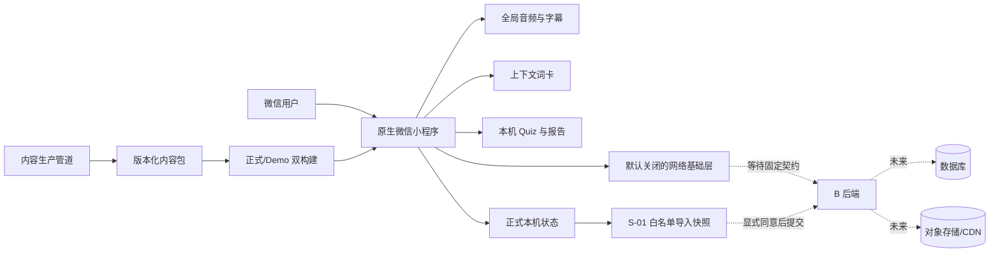

# 听阅小程序：技术架构与需求总览

> 版本：v2.0  
> 更新日期：2026-09-24  
> 状态：当前技术事实基线  
> 取代：`听阅小程序-技术架构与需求总览-v1.2.md`

## 0. 文档定位

本文说明听阅小程序当前已经落地的技术架构、正式产品边界、各任务真实进度、尚未完成的外部条件，以及后续开发顺序。

执行时按以下优先级处理冲突：

1. 实际代码、自动测试、构建产物和已归档验收证据；
2. `docs/正式产品实施计划-v1.1.md` 的任务编号、阶段门槛和完成定义；
3. 本文的架构总览与当前进度；
4. 模块专项文档和历史设计文档。

本文不会把浏览器预览、mock、AI 辅助审核、开发版上传或待联调接口写成已经上线；也不会把本机数据、客户端计算结果或 Demo 功能视为服务端可信事实。

---

## 1. 当前结论

项目已形成可重复构建、可自动回归的原生微信小程序客户端和内容生产管道，但仍处于内测与预发布开发阶段，**尚未上线、不得真实收款、不得正式发布内容**。

截至 2026-09-24：

| 项目 | 当前事实 |
| --- | --- |
| 阶段结论 | 阶段 0：`NO-GO` |
| 自动测试 | `90/90` 通过 |
| 正式产物 | 10 个路由；109 个文件、582,133 字节，仅含 Peter Rabbit 正式候选内容 |
| Demo 产物 | 13 个路由；196 个文件、2,501,285 字节，包含演示和历史样例 |
| 构建 | 正式/Demo 双构建可复现，具有独立配置、路由、内容和缓存命名空间 |
| 内容 | Peter Rabbit 1 篇候选内容；322.026 秒音频；59 条字幕；358 个正式词义；10 道 Quiz |
| 微信版本 | 正式开发版 `0.1.1` 已上传；尚未设为体验版，最新代码也尚未作为新版本上传 |
| 后端 | 尚无可联调的真实 B 后端；契约、数据库、登录、内容 API 和运维能力待同事分支实施 |
| 同步 | S-01 客户端白名单快照与 mock 提交基础已完成；真实 API、登录、回执和页面待后端 |
| 支付与发布 | 均未实施；被阶段 0、主体资格、收费路径、内容权利和真机证据阻断 |

### 1.1 已经能够证明的能力

- 单一源码可生成正式版和 Demo 两套物理隔离产物；
- Peter Rabbit 音频、字幕、词卡和 10 道双语 Quiz 已组成版本化内容包；
- 全局播放、跨页保持、可靠断点、听过区间去重、真实墙钟时长和完成门槛已有自动测试；
- 本机 Quiz 记录、报告聚合和排行榜空状态遵守“客户端不自证可信”的边界；
- 客户端具备默认关闭的通用网络层以及等待后端接入的 S-01 本机学习数据导入基础；
- 公开仓库中的审核记录会区分人工听审、授权 AI 辅助审核和待外审，不虚构签署。

### 1.2 当前不能宣称的能力

- 不能宣称已上线、已开放体验版或已完成 iPhone/Android 真机验收；
- 不能宣称已完成真实微信登录、跨设备同步、服务端判题或排行；
- 不能宣称已具备真实商品、订单、支付、退款、权益或对账能力；
- 不能宣称 Peter Rabbit 已获中国大陆公开商业发布批准；
- 不能把 `local_unverified` 的 Quiz 结果、客户端完成标记或 Demo 数据作为可信服务端事实；
- 不能把 AI 辅助全量审核表述为 `wzx` 本人逐项人工审核。

---

## 2. 正式产品范围

### 2.1 首版正式范围

正式产品聚焦以下主路径：

1. 用户从 Home、Recent 或书目列表进入 Peter Rabbit；
2. 播放真实音频并同步显示字幕；
3. 点击正文单词查看与当前语境匹配的词卡；
4. 完成固定 10 道双语理解题；
5. 在本机查看兼容版本的学习记录与报告；
6. 后端就绪后再启用真实登录、云端内容、可信判题和跨设备同步。

主导航固定为 Home / Recent / Me。Find Books 和 Borrowed 是二级入口；其中 Borrowed 目前只保留在 Demo，正式首版不开放。

### 2.2 明确排除或延后的范围

- 优惠券、邀请、演示购买、固定验证码和实体借阅仅属于 Demo 或历史演示；
- 历史 4 本书、7 个章节及其他旧内容不进入正式产品包；
- 正式支付、订阅、订单、退款、权益和排行榜均等待阶段 0 `GO` 及真实后端；
- 品牌名称、Logo、简介和适用类目可以最后确定，但在微信体验版和正式发布前必须完成；
- 本地草稿 Logo 不属于受控仓库资产，不得因技术文档更新而提交。

---

## 3. 当前系统架构

### 3.1 仓库主要结构

| 路径 | 职责 |
| --- | --- |
| `miniprogram/pages/`、`miniprogram/quiz/pages/` | 原生小程序页面与独立 Quiz 分包页面 |
| `miniprogram/modules/listen-read/` | 听读、播放状态、字幕与学习交互核心 |
| `miniprogram/modules/catalog/` | 正式书目和篇章目录 |
| `miniprogram/modules/quiz/` | Quiz attempt、本机反馈和兼容性边界 |
| `miniprogram/modules/report/` | 本机报告聚合、趋势门槛和排行榜空状态 |
| `miniprogram/services/host.js` | 本地状态、页面跳转和宿主能力适配 |
| `miniprogram/services/network/` | X-06 HTTP、鉴权、重试、取消和错误基础层 |
| `miniprogram/modules/sync/local-import.js` | S-01 本机学习数据白名单快照与提交边界 |
| `content/` | 内容源、审核记录、权利证据和版本化内容包 |
| `tools/content-pipeline/` | 字幕、词汇、Quiz、内容校验与导出工具 |
| `tests/` | 单元、边界、构建和回归测试 |
| `build/production-miniprogram/` | 生成的正式小程序产物 |
| `build/demo-miniprogram/` | 生成的 Demo 小程序产物 |
| `backend/`（当前分支尚不存在） | 约定由同事在 B 分支创建的后端实现根目录 |

### 3.2 正式与 Demo 隔离

- 默认 `project.config.json` 指向正式产物；`project.demo.config.json` 单独用于 Demo；
- 正式构建物理排除 Demo 路由、旧书、演示购买、固定验证码和开发缓存键；
- 正式缓存使用 `tingyue.product.v1`，Demo 使用 `tingyue.demo.v1`；
- 只有显式开发操作才能进入 Demo，不能因遗留本机状态误入；
- 两套构建均接受静态审计、浏览器回归和 SHA-256 可复现检查。

---

## 4. 客户端架构与可信边界

### 4.1 播放器：X-01 / X-02

X-01 已完成：

- 全局只有一个播放会话，页面切换不销毁真实播放状态；
- 保持篇目、当前位置、播放/暂停和倍速；
- 用户主动暂停后不被页面生命周期擅自恢复；
- 旧页面会退订事件，系统媒体事件和并发本机更新有回归覆盖。

X-02 为 `PARTIAL_B_AUDIO_PENDING`：

- 可信断点与听过区间分开存储；区间合并后计算唯一覆盖率；
- 学习时长按真实墙钟时间累计，不因倍速被重复放大；
- 超过 30 秒且位置或倍速不一致的异常后台采样不计入；
- 拖到结尾不会直接完成，也不会污染可信断点；
- 内容版本变化会使旧进度失效；
- 完成必须同时满足自然结束、唯一覆盖率至少 90%、尾部 3 秒已听。
- iOS 首次设置新音频地址后会显式调用 `play()`，不再依赖模拟器的隐式自动播放；播放器错误会保留平台返回的错误码或可序列化信息；相关回归测试已加入。

2026-09-24 已在 iPhone 14、iOS 26.6.2、微信 8.0.78、基础库 3.17.3 上启动真机验收。页面点击播放后进入 `error` 且停在 `00:00`；直接对 `BackgroundAudioManager` 执行同一 `src + play()` 仍失败，当前 Archive.org 地址在本次开发网络上也连接超时。由此只能证明当前运行时音频交付不可用，不能把问题归因于用户操作，也不能宣称 Archive.org 在所有网络永久不可用。D-01～D-09 暂停，等待 B 提供国内目标网络可访问的 HTTPS 对象存储/CDN地址并完成微信合法域名配置后继续。

### 4.2 词卡：X-03

X-03 已完成：

- 358 个审核义项覆盖 906 个可点击 token；
- 相同表面词可按当前字幕语境选择不同义项；
- 打开词卡会暂停播放；关闭时只有原本正在播放才恢复；
- 正式词卡来自已应用的 C-02 审核结果，不直接采用开放词典候选作为结论。

### 4.3 Quiz、报告与排行：X-04

X-04 客户端边界已完成：

- attempt 与 `contentVersion` 绑定并保存逐题选择；
- 客户端结果统一标为 `local_unverified`；
- 旧版本记录可以展示，但不能混入新版统计；
- 同一篇只取最新兼容 attempt；至少 6 篇才显示早期/近期趋势；
- 未接服务端时排行榜只显示不可用，不生成虚构用户、名次或筛选结果；
- 服务端判题边界已经记录在 `docs/Quiz-attempt-API-v1.md`。

### 4.4 客户端网络层：X-06

X-06 已完成通用基础，但未完成真实业务联调：

- 默认关闭并 fail-closed，没有生产域名；
- `wx.request` transport 可注入测试；
- access token 只驻留内存，不持久化 refresh token；
- 并发刷新只有一个请求，退出登录可清理竞态；
- 支持超时和取消；
- 仅 GET/HEAD 可对网络错误、超时、502、503、504 自动重试，最多 2 次；
- POST 等非幂等请求不自动重试；
- 对 UI 返回稳定、安全的错误文案，同时保留 `requestId` 和服务端稳定错误码用于诊断；
- 16 项专项测试通过。

尚未实现 `wx.login`、真实 token 生命周期、业务 API adapter 或真实域名。这些工作必须等待 B 提供固定契约版本和提交 SHA。

---

## 5. 本机状态与 S-01 导入

正式本机状态继续支持收藏、最近访问、进度、结果、听力时长和生词等学习体验；它是客户端体验数据，不是支付、权益或可信成绩来源。

S-01 当前状态为 `PARTIAL_BACKEND_PENDING`，客户端基础已经完成：

- 输入必须是显式传入的正式状态，不隐式读取 Demo；
- 只允许进度、生词和本机未验证 Quiz 三类白名单数据；
- Demo、购买、优惠券、权益和身份字段一律阻断；
- 进度只提交篇章/版本、时长、可信断点、听过区间和更新时间；不提交客户端派生的完成状态、覆盖率、听力秒数或资源 key；
- 生词只提交已审核的精确表面词，并声明 `limitations.words=surface_only`；
- Quiz 只提交 `local_unverified` 的 attempt 身份、题号、选择和时间；不提交客户端分数、掌握度、标题或可信状态；
- 同 ID 同载荷可去重，同 ID 不同载荷会阻断；
- 规范化快照生成确定性的 `s01-v1:<sha256>`；
- 提交必须获得显式同意，mock 提交采用 single-flight，不自动重试；
- 16 项专项测试通过。

尚缺：真实登录、固定的 `POST /api/v1/me/local-import` 契约、服务端幂等回执、导入页面和成功后的本机标记。服务端应以 `userId + snapshotId` 幂等处理，不得相信客户端派生结论。

---

## 6. 内容系统与当前内容包

### 6.1 Peter Rabbit 候选包

| 字段 | 当前值 |
| --- | --- |
| `workId` | `peter-rabbit` |
| `pieceId` | `peter-rabbit-01` |
| `contentVersion` | `1` |
| 音频 | 322.026 秒真实 MP3 |
| 字幕 | 59 条同步 cue |
| 字幕审核 | C-01 完成，`wzx` 完整听审并签署 28/28 个裁决 |
| 词汇 | 371 个审核单元形成 358 个正式义项 |
| 点词覆盖 | 906 个可点击 token |
| Quiz | 10 道项目原创双语理解题，每题绑定正文 cue 证据 |
| 权利状态 | `READY_FOR_EXTERNAL_REVIEW`，尚未 `APPROVED` |
| 发布状态 | `publishable:false` |

C-02 词汇和 C-04 元数据/Quiz 使用的是经 `wzx` 授权的 AI 辅助全量审核。该方式已如实记录，但不等同于本人逐项人工终审。C-03 已整理中国大陆公开商业使用的证据包并替换不明来源素材，仍须真实外部审核人签署。

### 6.2 内容包原则

每篇内容必须以稳定 ID 和版本号关联：

- 作品与篇章元数据；
- 音频及其可追溯来源；
- 字幕 cue 与人工/辅助审核记录；
- 上下文词义、词形和 token 映射；
- Quiz 题目、选项、答案和正文证据；
- 文件哈希、生成记录、审核状态和发布闸门。

客户端不能根据书名猜测作者、Series、ISBN、版本页数、F/NF 或权利结论。新增书目在后台上线前仍使用本地 JSON 和受控构建，未来再迁移为服务端内容发布流程。

---

## 7. 后端 B 的责任边界

后端由同事在与 `peter` 平行的长期分支开发。该分支取得最新 `peter` 和交接文档后自行创建；不在本仓库当前客户端工作中伪造一个“已完成后端”。

后端以 `backend/` 为实现根目录，并对以下内容负责：

- OpenAPI 3.1、JSON Schema 和稳定错误码；
- 数据库模型、迁移、回滚和最小种子数据；
- 微信服务端登录、session、token 生命周期和账户绑定；
- 内容目录、受控资源地址和授权校验；
- Quiz 服务端判题和可信 attempt；
- S-01 本机学习数据幂等导入；
- 日志、监控、备份、告警、审计和运行手册。

通用约束：`/api/v1`、HTTPS、JSON、camelCase、UTC RFC 3339、游标分页、`requestId` 和稳定错误码。`peter` 只在拿到明确的契约版本和 B 分支提交 SHA 后联调，不能凭口头约定或临时 mock 固化接口。

| B 任务 | 状态 | 说明 |
| --- | --- | --- |
| B-01 环境与技术基线 | `BLOCKED` | 待同事确定运行时、框架、数据库、国内目标网络可访问的对象存储/CDN、合法域名、地域和环境 |
| B-02 数据库与迁移 | `TODO` | 尚无权威 schema/migration |
| B-03 微信会话 | `TODO` | 尚无真实 `wx.login` 服务端交换与 token 生命周期 |
| B-04 内容 API/资源授权 | `TODO` | 尚无真实内容目录、可播放音频资源地址、签名资源和 Quiz 判题服务 |
| B-05 运维基础 | `TODO` | 尚无部署、监控、备份、告警和回滚证据 |

---

## 8. 全量任务进度

### 8.1 内容 C

| 任务 | 状态 | 当前结论 |
| --- | --- | --- |
| C-01 字幕听审 | `DONE` | 完整听审 322.026 秒；28/28 裁决签署；59 条正式 cue |
| C-02 词汇审核 | `DONE` | 授权 AI 辅助全量审核；371 单元形成 358 义项；未声称人工逐项终审 |
| C-03 权利审核 | `READY_FOR_EXTERNAL_REVIEW` | 证据包已整理；等待真实外部审核签署；不得发布 |
| C-04 元数据与 Quiz | `DONE` | 授权 AI 辅助审核；稳定 ID、10 题、cue 证据和 v1 哈希清单已落地 |
| C-05 发布批准 | `TODO/BLOCKED` | 等待权利、产品、隐私、真机和阶段 0 全部通过 |

### 8.2 客户端 X

| 任务 | 状态 | 当前结论 |
| --- | --- | --- |
| X-01 全局播放会话 | `DONE` | 跨页、暂停意图、倍速和系统事件已覆盖 |
| X-02 可靠进度 | `PARTIAL_B_AUDIO_PENDING` | iPhone 已复现 `00:00` 播放阻断；客户端显式首次播放与诊断已补，等待 B 音频托管/CDN和合法域名后继续 D-01～D-09 |
| X-03 上下文词卡 | `DONE` | 358 义项、906 token 及播放意图联动已完成 |
| X-04 Quiz/报告可信边界 | `DONE` | 本机未验证、版本兼容、6 篇趋势门槛和空排行已完成 |
| X-05 正式/Demo 隔离与发布证据 | `PARTIAL` | 双构建和开发版 0.1.1 完成；品牌资料、体验版及双端证据未完成 |
| X-06 网络基础层 | `DONE` | fail-closed 通用层完成；真实业务 adapter 等待 B 契约 |

### 8.3 同步 S

| 任务 | 状态 | 当前结论 |
| --- | --- | --- |
| S-01 本机学习数据导入 | `PARTIAL_BACKEND_PENDING` | 客户端白名单快照与 mock 提交完成；真实 API/回执/UI 待 B |
| S-02 云端进度同步 | `TODO` | 等待账户、schema、冲突策略和真实 API |
| S-03 生词同步 | `TODO` | 等待服务端词条身份和合并规则 |
| S-04 Quiz/报告同步 | `TODO` | 等待服务端判题、可信状态和跨设备聚合 |

### 8.4 支付 P 与发布 R

P-01～P-05 和 R-01～R-05 当前全部为 `BLOCKED`。阶段 0 未 `GO` 前不得实现或启用真实交易，不得以客户端本地状态解锁权益，也不得绕过权利、隐私、退款、对账、客服、监控和回滚门槛。

---

## 9. 测试、构建与发布状态

### 9.1 自动验证

- 全量自动测试：90/90；
- 内容结构检查：10 本源内容通过结构校验，但只有 Peter Rabbit 进入正式候选包；
- 正式/Demo 构建哈希可复现；
- 两套生成产物完成浏览器主交互回归；
- 已覆盖可靠进度、上下文词卡、Quiz 可信边界、物理隔离、网络层和 S-01 导入边界。

自动测试不替代以下验收：完整人工内容审核、外部权利意见、微信账号和类目审核、真实后端联调、真实支付、弱网/锁屏/系统控制、Android/iPhone 真机和上线后的监控恢复。

### 9.2 微信发布现状

- 目标小程序后台已经能够登录；
- 开发版 `0.1.1` 已上传并归档版本、Git 提交、构建哈希和包体信息；
- 微信后台仍受基本资料初始化流程影响，尚不能完成版本管理闭环；
- 名称、头像、简介、适用类目和品牌资料尚待最终确认；
- `0.1.1` 尚未设为体验版；
- 当前最新代码包含 X-06 和 S-01，尚未重新构建并上传为新的微信开发版本；
- 没有体验版/正式版 Android 与 iPhone 双端证据。

---

## 10. 阶段 0 与关键阻断

阶段 0 当前统计为：`PASS 0 / PARTIAL 3 / BLOCKED 11 / N/A 0`，结论为 `NO-GO`。

必须关闭的主要阻断包括：

1. 确定公开名称、Logo、简介、服务类目和运营主体资料；
2. 确认小程序认证、商户绑定、支付权限及 Android/iPhone 收费路径；
3. 明确正式商品、售价、试读、退款、客服和对账规则；
4. 完成 Peter Rabbit 中国大陆公开商业使用外部审核签署；
5. 明确隐私政策、未成年人数据处理和实际数据流；
6. 确定云供应商、地域、预算、负责人和故障处置机制；
7. 完成 B-01～B-05 并冻结可联调契约，其中 B-01/B-04 必须先交付可在目标网络和 iPhone 微信中播放的音频资源；
8. 音频交付就绪后继续完成 X-02 D-01～D-09，再补 X-05 的体验版证据；
9. 在阶段 0 全部退出条件满足后，由项目负责人签署 `GO`。

---

## 11. 后续开发顺序

在品牌资料暂不确定、B 由同事并行开发的前提下，推荐按以下顺序推进：

1. **优先完成 B 音频交付**：B-01/B-04 提供国内目标网络可访问、HTTPS、支持 Range 请求且已配置微信合法域名的 MP3 地址，并固定资源 SHA-256、字节数、MIME、时长、`pieceId` 和 `contentVersion`；
2. **恢复 X-02 真机验收**：替换受控音频地址后在同一 iPhone 重新执行 D-01～D-09，完成后台、锁屏、系统控制、断点和时长证据；
3. **审查其余 B-01 交付**：确认契约版本、B 分支 SHA、运行环境、数据库和 token 生命周期；
4. **完成 S-01 联调**：接真实 `POST /api/v1/me/local-import`，验证 `userId + snapshotId` 幂等、冲突和真实回执，再补导入 UI；
5. **推进 S-02～S-04**：分别完成进度、生词、Quiz/报告同步，先定义冲突策略，再实现客户端；
6. **品牌资料确定后关闭 X-05**：完成基本资料、上传最新开发版、设为体验版并做 Android/iPhone 复验；
7. **并行完成 C-03 外审与阶段 0 外部材料**；
8. **只有阶段 0 `GO` 后**才启动 P 支付与 R 发布阶段。

如果 B 契约暂时没有交付，可继续做非生产、可逆、不会伪装联调完成的工作，例如补真机验收模板、改善可访问性、扩大边界测试和整理发布证据；不要提前硬编码真实接口或开启支付。

---

## 12. 分支、契约与提交原则

- `peter` 是当前客户端和集成基线；日常工作分支最终更新到该远端分支；
- B 同事自行从约定基线创建与 `peter` 平行的长期分支；
- B 分支中的 OpenAPI、Schema 和 migration 是后端权威来源；
- `peter` 通过“契约版本 + B 提交 SHA”固定联调输入；
- 合并前必须确保测试、构建、文档和状态描述一致；
- 私有配置、个人凭证、token、未定稿品牌资产和开发者本机配置不得提交；
- 历史文档可以保留追溯，但不得继续作为执行基线。

---

## 13. 相关执行文档

- `docs/正式产品实施计划-v1.1.md`：主计划、任务 ID、阶段门槛和完成定义；
- `开发进度与待办.md`：按日期更新的短版状态；
- `docs/阶段0核验表-v1.0.md`：上线、收费和外部条件核验；
- `docs/X-B后端开发交接文档-v1.md`：X/B 分支、契约和职责交接；
- `docs/X-06客户端网络基础层-v1.md`：客户端通用网络层；
- `docs/X-02-iPhone真机验收记录-2026-09-24.md`：当前 iPhone 真机验收对象、步骤和证据表；
- `docs/S-01本机学习数据导入客户端基础-v1.md`：本机数据导入边界；
- `docs/Quiz-attempt-API-v1.md`：Quiz 服务端判题契约；
- `docs/内容权利台账-v1.0.md`：内容权利状态；
- `录音-字幕-点词内容管道设计-v1.0.md`：内容包和处理管道；
- `听阅小程序-页面设计与技术实现说明书-v1.0.md`：页面与交互实现参考。

---

## 14. v2.0 修订摘要

相较 v1.2，本版主要调整如下：

- 从早期愿景文档改为基于代码、测试和证据的当前技术基线；
- 不再强调“移植”或将历史产品作为正式架构目标；
- 正式区分正式产品、Demo、mock、客户端未验证数据和服务端可信事实；
- 更新为 Peter Rabbit 59 条字幕、358 个词义、906 个 token 和 10 道 Quiz 的真实状态；
- 纳入 X-01～X-06、S-01、B-01～B-05 以及 P/R 阶段的实际进度；
- 增加正式/Demo 双构建、网络层、同步导入、分支契约和发布阻断说明；
- 删除“零版权成本”“AI 替代人工”“虚构排行榜”和未经验证的上线排期等不稳健表述；
- 明确阶段 0 `NO-GO`、权利外审、微信资料、后端、真机和支付仍是发布前置条件。
- 记录 X-02 iPhone 首次播放修复与真实阻断：客户端自动测试通过，但现用 Archive.org 运行时地址不可作为可验收的正式音频交付；后续由 B 的对象存储/CDN和合法域名先行解阻。
