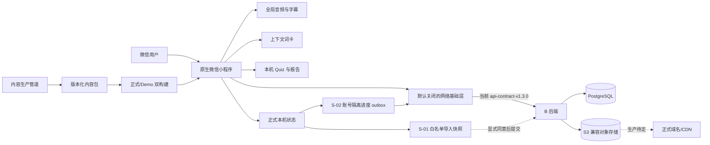

# 听阅小程序：技术架构与需求总览

> 版本：v4.0
> 更新日期：2026-10-09
> 状态：当前技术事实基线；交接快照，非上线批准
> 取代并删除：`听阅小程序-技术架构与需求总览-v3.0.md`；更早的 v1.1、v1.2、v2.0 也已删除

## 0. 文档定位

本文说明听阅小程序当前已经落地的技术架构、正式产品边界、各任务真实进度和未关闭条件。本文不规定未完成事项的先后顺序；同事接手的操作入口见 `docs/项目交接文档-2026-10-09.md`。

执行时按以下优先级处理冲突：

1. 实际代码、自动测试、构建产物和已归档验收证据；
2. 本文的当前架构与状态；
3. `docs/正式产品实施计划-v1.1.md` 的任务编号、阶段门槛和完成定义；
4. 有日期的模块专项证据优于历史设计稿；时间点记录只说明当时结果。

本文不会把浏览器预览、mock、AI 辅助审核、开发版上传或待联调接口写成已经上线；也不会把本机数据、客户端计算结果或 Demo 功能视为服务端可信事实。

---

## 1. 当前结论

项目已形成可重复构建、可自动回归的原生微信小程序客户端和内容生产管道，但仍处于内测与预发布开发阶段，**尚未上线、不得真实收款、不得正式发布内容**。

截至 2026-10-09：

| 项目 | 当前事实 |
| --- | --- |
| 阶段结论 | 阶段 0：`NO-GO` |
| 自动测试 | 2026-10-09 重跑客户端 `110/110`、后端 `57/57`、契约 `5/5`；后端类型检查与密钥扫描通过 |
| 正式产物 | 10 个路由；114 个文件、660,174 字节，仅含 Peter Rabbit 正式候选内容 |
| Demo 产物 | 13 个路由；201 个文件、2,592,148 字节，包含演示和历史样例 |
| 构建 | 正式/Demo 双构建可复现，具有独立配置、路由、内容和缓存命名空间 |
| 内容 | Peter Rabbit 1 篇候选内容；322.026 秒音频；59 条字幕；358 个正式词义；10 道 Quiz |
| 微信版本 | 历史生产模式代码包 `0.1.1` 上传记录对应“小程序测试号”；2026-10-09 又生成测试号开发预览码用于诊断，未上传新开发版、未形成个人账号体验版 |
| 后端 | 已选择性接入 `backend/v1@533a64e` 的 S-03；当前契约为 `api-contract-v1.3.0`，保留 S-02 单篇接口和 0008，新增 S-03 的 0009 |
| 同步 | 当前工作区 S-01、S-02、S-03 均为 `DONE_LOCAL_TEST`；S-04 本机双会话综合脚本通过，真机状态为 `PARTIAL_DEVICE_PENDING`。iPhone 音频失败，Android 未做本轮对照 |
| 支付与发布 | 均未实施；被阶段 0、主体资格、收费路径、内容权利和真机证据阻断 |

### 1.1 已经能够证明的能力

- 单一源码可生成正式版和 Demo 两套物理隔离产物；
- Peter Rabbit 音频、字幕、词卡和 10 道双语 Quiz 已组成版本化内容包；
- 全局播放、跨页保持、可靠断点、听过区间去重、真实墙钟时长和完成门槛已有自动测试；
- 本机 Quiz 记录、报告聚合和排行榜空状态遵守“客户端不自证可信”的边界；
- 客户端具备默认关闭的通用网络层，S-01 一次性导入与 S-02 日常进度同步已完成本机真实依赖闭环；
- 公开仓库中的审核记录会区分人工听审、授权 AI 辅助审核和待外审，不虚构签署。

### 1.2 当前不能宣称的能力

- 不能宣称已上线、已开放体验版或已完成 iPhone/Android 真机验收；
- 不能宣称已完成真实微信登录、日常跨设备同步，或生产环境的服务端判题与排行验收；
- 不能宣称已具备真实商品、订单、支付、退款、权益或对账能力；
- 不能宣称 Peter Rabbit 已获中国大陆公开商业发布批准；
- 不能把 `local_unverified` 的 Quiz 结果、客户端完成标记或 Demo 数据作为可信服务端事实；
- 不能把 AI 辅助全量审核表述为 `wzx` 本人逐项人工审核。

---

## 2. 正式产品范围

### 2.1 首版正式范围

正式产品聚焦以下主路径：

1. 用户从 Home、Recent 或书目列表进入 Peter Rabbit；
2. 播放真实音频并同步显示字幕；
3. 点击正文单词查看与当前语境匹配的词卡；
4. 完成固定 10 道双语理解题；
5. 在本机查看兼容版本的学习记录与报告；
6. 后端就绪后再启用真实登录、云端内容、可信判题和跨设备同步。

主导航固定为 Home / Recent / Me。Find Books 和 Borrowed 是二级入口；其中 Borrowed 目前只保留在 Demo，正式首版不开放。

### 2.2 明确排除或延后的范围

- 优惠券、邀请、演示购买、固定验证码和实体借阅仅属于 Demo 或历史演示；
- 历史 4 本书、7 个章节及其他旧内容不进入正式产品包；
- 正式支付、订阅、订单、退款、权益和排行榜均等待阶段 0 `GO` 及真实后端；
- 品牌名称、Logo、简介和适用类目可以最后确定，但在微信体验版和正式发布前必须完成；
- 本地草稿 Logo 不属于受控仓库资产，不得因技术文档更新而提交。

---

## 3. 当前系统架构

### 3.1 仓库主要结构

| 路径 | 职责 |
| --- | --- |
| `miniprogram/pages/`、`miniprogram/quiz/pages/` | 原生小程序页面与独立 Quiz 分包页面 |
| `miniprogram/modules/listen-read/` | 听读、播放状态、字幕与学习交互核心 |
| `miniprogram/modules/catalog/` | 正式书目和篇章目录 |
| `miniprogram/modules/quiz/` | Quiz attempt、本机反馈和兼容性边界 |
| `miniprogram/modules/report/` | 本机报告聚合、趋势门槛和排行榜空状态 |
| `miniprogram/services/host.js` | 本地状态、页面跳转和宿主能力适配 |
| `miniprogram/services/network/` | X-06 HTTP、鉴权、重试、取消和错误基础层 |
| `miniprogram/modules/sync/local-import.js` | S-01 本机学习数据白名单快照与提交边界 |
| `miniprogram/modules/sync/progress-sync.js` | S-02 账号隔离 outbox、云端基线、overlay、拉取和重试 |
| `content/` | 内容源、审核记录、权利证据和版本化内容包 |
| `tools/content-pipeline/` | 字幕、词汇、Quiz、内容校验与导出工具 |
| `tests/` | 单元、边界、构建和回归测试 |
| `build/production-miniprogram/` | 生成的正式小程序产物 |
| `build/demo-miniprogram/` | 生成的 Demo 小程序产物 |
| `backend/` | 从 `backend/v1` 选择性接收的后端实现、契约、migration、Worker、测试与运行手册 |

### 3.2 正式与 Demo 隔离

- 默认 `project.config.json` 指向正式产物；`project.demo.config.json` 单独用于 Demo；
- 正式构建物理排除 Demo 路由、旧书、演示购买、固定验证码和开发缓存键；
- 正式缓存使用 `tingyue.product.v1`，Demo 使用 `tingyue.demo.v1`；
- 只有显式开发操作才能进入 Demo，不能因遗留本机状态误入；
- 两套构建均接受静态审计、浏览器回归和 SHA-256 可复现检查。

---

## 4. 客户端架构与可信边界

### 4.1 播放器：X-01 / X-02

X-01 已完成：

- 全局只有一个播放会话，页面切换不销毁真实播放状态；
- 保持篇目、当前位置、播放/暂停和倍速；
- 用户主动暂停后不被页面生命周期擅自恢复；
- 旧页面会退订事件，系统媒体事件和并发本机更新有回归覆盖。

X-02 为 `PARTIAL_B_AUDIO_PENDING`：

- 可信断点与听过区间分开存储；区间合并后计算唯一覆盖率；
- 学习时长按真实墙钟时间累计，不因倍速被重复放大；
- 超过 30 秒且位置或倍速不一致的异常后台采样不计入；
- 拖到结尾不会直接完成，也不会污染可信断点；
- 内容版本变化会使旧进度失效；
- 完成必须同时满足自然结束、唯一覆盖率至少 90%、尾部 3 秒已听。
- iOS 首次设置新音频地址后会显式调用 `play()`，不再依赖模拟器的隐式自动播放；播放器错误会保留平台返回的错误码或可序列化信息；相关回归测试已加入。

2026-09-24 已在 iPhone 14、iOS 26.6.2、微信 8.0.78、基础库 3.17.3 上启动真机验收。页面点击播放后进入 `error` 且停在 `00:00`；直接对 `BackgroundAudioManager` 执行同一 `src + play()` 仍失败，当前 Archive.org 地址在本次开发网络上也连接超时。由此只能证明当前运行时音频交付不可用，不能把问题归因于用户操作，也不能宣称 Archive.org 在所有网络永久不可用。D-01～D-09 暂停，等待 B 提供国内目标网络可访问的 HTTPS 对象存储/CDN地址并完成微信合法域名配置后继续。

2026-10-09 的测试号开发预览中，用户确认 iPhone 已显示字幕，但进度条不动且提示音频加载失败；临时开发诊断行只显示“音频错误码：未知”，不足以判断平台错误类型。同一 MP3 直链在该 iPhone 的 Safari 也打不开，说明当前地址不能用于这台手机/当前网络的音频验收，**不证明播放器其余逻辑无问题**。片头 cue 的 `tokens: []` 导致无字问题已修复并加回归测试；“无法拨动字幕”尚需区分字幕区手势与播放进度条拖动，不能标记为已解决。Android 本轮未测。证据见 `docs/S-04个人主体类目咨询与开发预览-2026-10-09.md`。

### 4.2 词卡：X-03

X-03 已完成：

- 358 个审核义项覆盖 906 个可点击 token；
- 相同表面词可按当前字幕语境选择不同义项；
- 打开词卡会暂停播放；关闭时只有原本正在播放才恢复；
- 正式词卡来自已应用的 C-02 审核结果，不直接采用开放词典候选作为结论。

### 4.3 Quiz、报告与排行：X-04

X-04 客户端边界已完成：

- attempt 与 `contentVersion` 绑定并保存逐题选择；
- 客户端结果统一标为 `local_unverified`；
- 旧版本记录可以展示，但不能混入新版统计；
- 同一篇只取最新兼容 attempt；至少 6 篇才显示早期/近期趋势；
- 未接服务端或未登录时排行榜只显示对应状态，不生成虚构用户、名次或筛选结果；
- 已接入 B-06 的真实选项、榜单和匿名明细 API，支持校区、最近七天/周/月、年级、级别、游标分页和重试；
- 样本不足时客户端防御性清空名单，明细只显式映射匿名成绩构成与小测摘要，不接收逐题答案或身份字段；
- 2026-09-28 使用自动清理的隔离 schema 完成 55 人真实 HTTP 联调：榜单 50+5、详情 50+2，最近七天/周/月和小样本隐藏均通过；
- 服务端判题边界已经记录在 `docs/Quiz-attempt-API-v1.md`。

### 4.4 客户端网络层：X-06

X-06 通用基础和当前契约的本机核心业务联调已完成：

- 默认关闭并 fail-closed，没有生产域名；
- `wx.request` transport 可注入测试；
- access token 只驻留内存，不持久化 refresh token；
- 并发刷新只有一个请求，退出登录可清理竞态；
- 支持超时和取消；
- 仅 GET/HEAD 可对网络错误、超时、502、503、504 自动重试，最多 2 次；
- POST 等非幂等请求不自动重试；
- 对 UI 返回稳定、安全的错误文案，同时保留 `requestId` 和服务端稳定错误码用于诊断；
- session/refresh、content manifest、Quiz 提交、ranking options/list/detail 已接入当前客户端；
- 16 项网络层专项测试及排行榜页面边界测试通过。

本机 stub 微信会话与真实 token 刷新链路已联调；尚未配置真实 AppID/AppSecret、HTTPS 合法域名或生产部署，因此不能据此宣称真实微信登录已验收。

---

## 5. 本机状态与同步架构

### 5.1 S-01 显式导入

正式本机状态继续支持收藏、最近访问、进度、结果、听力时长和生词等学习体验；它是客户端体验数据，不是支付、权益或可信成绩来源。

S-01 当前状态为 `DONE_LOCAL_TEST`，客户端与服务端本机闭环已经完成：

- 输入必须是显式传入的正式状态，不隐式读取 Demo；
- 只允许进度、生词和本机未验证 Quiz 三类白名单数据；
- Demo、购买、优惠券、权益和身份字段一律阻断；
- 进度只提交篇章/版本、时长、可信断点、听过区间和更新时间；不提交客户端派生的完成状态、覆盖率、听力秒数或资源 key；
- 生词只提交已审核的精确表面词，并声明 `limitations.words=surface_only`；
- Quiz 只提交 `local_unverified` 的 attempt 身份、题号、选择和时间；不提交客户端分数、掌握度、标题或可信状态；
- 同 ID 同载荷可去重，同 ID 不同载荷会阻断；
- 规范化快照生成确定性的 `s01-v1:<sha256>`；
- 提交必须获得显式同意，采用 single-flight，不自动重试；
- `POST /api/v1/me/local-import` 已进入 `api-contract-v1.1.0`，`Idempotency-Key` 必须等于确定性 `snapshotId`；
- 服务端按已发布音频重新计算进度与完成状态，把词面生词保存为待解析候选，并按正式题库复判 Quiz；
- migration 0007 持久化导入快照、学习进度、待解析词面和真实回执；
- 客户端只在收到回执后记录最近 10 条确认，不删除本机数据；
- 2026-10-09 本轮客户端 110/110、后端 57/57、契约 5/5 通过；S-01、S-02 与 S-03 隔离真实 HTTP/PostgreSQL 联调是先前复验证据。

### 5.2 S-02 日常进度同步

S-02 状态为 `DONE_LOCAL_TEST`：

- 进度接口首次发布于 `api-contract-v1.2.0`，当前总契约为 v1.3.0；仍提供单篇 PUT、单篇 GET 和 cursor 分页列表；
- 登录账号以服务端进度为权威，本机保存云端基线、未确认 overlay 与账号隔离 outbox；
- 同版本听过区间取并集；旧 base revision 仍贡献区间但不能覆盖新断点；完成状态只允许单调前进；
- mutation 回执保留 30 天，退出停止发送，同账号重新登录恢复；
- migration 0008 保存多内容版本 revision、历史标记和幂等回执；
- PostgreSQL 18 中 migration 0001～0009 升级、回滚、再升级通过，共核验 36 张表；
- 客户端→Fastify→PostgreSQL 真实 HTTP smoke test 通过，验证 revision、幂等重放、迟到区间合并和分页；
- 真实微信、生产域名、弱网和双设备真机仍不属于本机完成状态。

### 5.3 S-03 稳定生词云同步

当前 `api-contract-v1.3.0` 提供 `POST /api/v1/me/words/sync`：每批最多 50 个 operation，按签名 cursor 拉取最多 100 个 change。稳定 entry 保存 revision、墓碑、历史和 change sequence；客户端按账号隔离不可变批次并使用原 batch ID 重试。

旧 revision 删除采用 delete-wins；旧保存不能复活墓碑，用户拉到最新 tombstone revision 后可以显式恢复。每用户每分钟最多 30 个同步批次。S-01 的纯词面候选继续 pending，不自动冒充稳定词条。

2026-10-09 的 S-03 专项复验记录了当时客户端 109/109、后端 57/57、契约 5/5、密钥扫描、9 条 migration/36 张表、S-01～S-03 真实 PostgreSQL/HTTP smoke、静态检查与双构建可复现均通过。新增字幕/诊断回归后，本轮客户端 110/110、后端 57/57、契约 5/5、类型检查、密钥扫描、双构建可复现与两套产物静态检查通过；本轮未重跑 migration 或 HTTP smoke。来源分支 C-04 metadata hash 问题没有进入当前工作区。

S-02 继续使用单篇 `PUT/GET` 和 `0008_daily_progress_sync`，S-03 使用独立的 `0009_saved_word_sync`。详细协议与当前证据见 `docs/S-03云端生词同步-v1.md`；来源分支的接收前冲突记录见 `docs/S-03生词云同步交接文档-2026-09-29.md`。

尚缺真实微信、HTTPS 合法域名、弱网、退出/重装和 Android/iPhone 双真机一致性。这些属于 S-04 和上线验收。

---

## 6. 内容系统与当前内容包

### 6.1 Peter Rabbit 候选包

| 字段 | 当前值 |
| --- | --- |
| `workId` | `peter-rabbit` |
| `pieceId` | `peter-rabbit-01` |
| `contentVersion` | `1` |
| 音频 | 322.026 秒真实 MP3 |
| 字幕 | 59 条同步 cue |
| 字幕审核 | C-01 完成，`wzx` 完整听审并签署 28/28 个裁决 |
| 词汇 | 371 个审核单元形成 358 个正式义项 |
| 点词覆盖 | 906 个可点击 token |
| Quiz | 10 道项目原创双语理解题，每题绑定正文 cue 证据 |
| 权利状态 | `READY_FOR_EXTERNAL_REVIEW`，尚未 `APPROVED` |
| 发布状态 | `publishable:false` |

C-02 词汇和 C-04 元数据/Quiz 使用的是经 `wzx` 授权的 AI 辅助全量审核。该方式已如实记录，但不等同于本人逐项人工终审。C-03 已整理中国大陆公开商业使用的证据包并替换不明来源素材，仍须真实外部审核人签署。

### 6.2 内容包原则

每篇内容必须以稳定 ID 和版本号关联：

- 作品与篇章元数据；
- 音频及其可追溯来源；
- 字幕 cue 与人工/辅助审核记录；
- 上下文词义、词形和 token 映射；
- Quiz 题目、选项、答案和正文证据；
- 文件哈希、生成记录、审核状态和发布闸门。

客户端不能根据书名猜测作者、Series、ISBN、版本页数、F/NF 或权利结论。新增书目在后台上线前仍使用本地 JSON 和受控构建，未来再迁移为服务端内容发布流程。

---

## 7. 后端 B 的责任边界

后端由同事在与 `peter` 平行的 `backend/v1` 开发，并已以提交 `9efe8aac1d499fb14a81929ae3106fdea823cb25` 交付。本次只选择性接收 `backend/`、后端 CI 和专项文档，没有把该分支基于旧 `peter` 的前端改动覆盖到当前客户端。后端代码已接收不等于生产部署或当前 X/B 联调完成。

后端以 `backend/` 为实现根目录，并对以下内容负责：

- OpenAPI 3.1、JSON Schema 和稳定错误码；
- 数据库模型、迁移、回滚和最小种子数据；
- 微信服务端登录、session、token 生命周期和账户绑定；
- 内容目录、受控资源地址和授权校验；
- Quiz 服务端判题和可信 attempt；
- S-01 本机学习数据幂等导入；
- 日志、监控、备份、告警、审计和运行手册。

通用约束：`/api/v1`、HTTPS、JSON、camelCase、UTC RFC 3339、游标分页、`requestId` 和稳定错误码。`peter` 只在拿到明确的契约版本和 B 分支提交 SHA 后联调，不能凭口头约定或临时 mock 固化接口。

| B 任务 | 状态 | 说明 |
| --- | --- | --- |
| B-01 环境与技术基线 | `PARTIAL` | Node.js 24、TypeScript、Fastify、PostgreSQL、Redis/BullMQ、S3 兼容存储和 FFmpeg 已冻结；生产云厂商、地域、预算、域名和负责人待确认 |
| B-02 数据库与迁移 | `DONE_LOCAL_TEST` | 当前 9 条成对 migration；第 7 条增加 S-01 导入快照、学习进度和待解析词面候选，第 8 条增加 S-02 revision、多版本进度和 mutation 回执；第 9 条增加 S-03 生词状态、历史、墓碑与幂等批次；生产备份/PITR策略待确认 |
| B-03 微信会话 | `DONE_LOCAL_TEST` | code2Session 适配、JWT/refresh 轮换、退出和 `/me` 已实现；真实 AppID/AppSecret、合法域名和微信环境待联调 |
| B-04 内容 API/资源授权 | `PARTIAL_VALIDATION_PENDING` | 内容导入、Worker、works/work/manifest、短期私有 URL 和 Quiz 判分已实现；当前客户端核心接口与本机依赖联调通过，正式资源域名/CDN、规模压测和真机联调未完成 |
| B-05 运维基础 | `DONE_LOCAL_TEST` | 日志、指标、审计、安全、恢复脚本和 Grafana 面板已交付；生产平台、阈值、告警接收人与恢复责任待确认 |
| B-06 排行 | `DONE_LOCAL_PAGE_TEST` | `quiz-score-v1`、不可变快照、重建 Worker、筛选/榜单/明细 API 与完整客户端页面已实现；55 人真实 HTTP 隔离联调覆盖筛选、50+5 分页、50+2 明细、小样本隐藏及匿名字段边界；真实微信账号和生产规模待验收 |

2026-09-28 本机补充验证：使用隔离 PostgreSQL 15432、Redis 和获许可的本地 AIStor Free，6 条迁移、对象存储初始化、内容导入、X/B 核心接口、安全检查均通过；Fastify API 的 `/health/ready` 确认三个依赖正常，独立 Worker 成功消费队列任务。详细命令、镜像边界和未完成项见 `docs/B后端接收记录-2026-09-28.md`。该证据不替代目标网络、微信真机或生产验收。

---

## 8. 全量任务进度

### 8.1 内容 C

| 任务 | 状态 | 当前结论 |
| --- | --- | --- |
| C-01 字幕听审 | `DONE` | 完整听审 322.026 秒；28/28 裁决签署；59 条正式 cue |
| C-02 词汇审核 | `DONE` | 授权 AI 辅助全量审核；371 单元形成 358 义项；未声称人工逐项终审 |
| C-03 权利审核 | `READY_FOR_EXTERNAL_REVIEW` | 证据包已整理；等待真实外部审核签署；不得发布 |
| C-04 元数据与 Quiz | `DONE` | 授权 AI 辅助审核；稳定 ID、10 题、cue 证据和 v1 哈希清单已落地 |
| C-05 发布批准 | `TODO/BLOCKED` | 等待权利、产品、隐私、真机和阶段 0 全部通过 |

### 8.2 客户端 X

| 任务 | 状态 | 当前结论 |
| --- | --- | --- |
| X-01 全局播放会话 | `DONE` | 跨页、暂停意图、倍速和系统事件已覆盖 |
| X-02 可靠进度 | `BLOCKED_B_AUDIO_DELIVERY`（真机音频验收） | 2026-09-24 真机记录使用此状态；2026-10-09 同一 MP3 在 iPhone Safari 亦打不开，开发预览进度仍不动；须用 iPhone 可访问的受控 HTTPS 音源复测 D-01～D-09。旧短版的 `PARTIAL_B_AUDIO_PENDING` 表达同一未关闭阻断 |
| X-03 上下文词卡 | `DONE` | 358 义项、906 token 及播放意图联动已完成 |
| X-04 Quiz/报告可信边界 | `DONE` | 本机未验证、版本兼容、6 篇趋势门槛和空排行已完成 |
| X-05 正式/Demo 隔离与发布证据 | `PARTIAL` | 双构建完成；0.1.1 历史上传对应测试号，不能计入已注册小程序体验版；目标账号、类目及双端证据未完成 |
| X-06 网络基础层 | `DONE` | fail-closed 通用层完成；会话、内容、Quiz、排行和 local-import adapter 已接本机 B 契约，生产域名待配置 |

### 8.3 同步 S

| 任务 | 状态 | 当前结论 |
| --- | --- | --- |
| S-01 本机学习数据导入 | `DONE_LOCAL_TEST` | 白名单快照、显式同意 UI、真实 API、服务端可信重算、幂等回执和本机真实依赖联调完成 |
| S-02 云端进度同步 | `DONE_LOCAL_TEST` | v1.2.0 接口，当前总契约 v1.3.0、migration 0008、服务端合并、账号隔离 outbox、重试和状态 UI 已实现；隔离 PostgreSQL/真实 HTTP 复验通过 |
| S-03 生词同步 | `DONE_LOCAL_TEST` | 已从 `backend/v1@533a64e` 选择性接入 v1.3.0，新增独立 0009、delete-wins 墓碑、历史/change sequence、账号隔离队列和状态 UI；双设备 HTTP/PostgreSQL smoke 通过 |
| S-04 双设备综合验收 | `PARTIAL_DEVICE_PENDING` | 本机真实 HTTP/PostgreSQL 双会话脚本已覆盖进度合并、生词墓碑、幂等重放、账户隔离及退出撤销；测试号 iPhone 开发预览仅属分项诊断，音频失败、Android 未测；仍需真实微信、HTTPS 域名、双端、弱网与重装证据。Quiz/报告日常同步另行立项 |

### 8.4 支付 P 与发布 R

P-01～P-05 和 R-01～R-05 当前全部为 `BLOCKED`。阶段 0 未 `GO` 前不得实现或启用真实交易，不得以客户端本地状态解锁权益，也不得绕过权利、隐私、退款、对账、客服、监控和回滚门槛。

---

## 9. 测试、构建与发布状态

### 9.1 自动验证

- 客户端全量自动测试：2026-10-09 重跑 110/110；
- 后端本轮 57/57 测试、TypeScript 类型检查、契约 5/5 和密钥扫描通过；
- 内容结构检查：10 本源内容通过结构校验，但只有 Peter Rabbit 进入正式候选包；
- 正式/Demo 构建哈希可复现（本轮分别为 `c7f35610aba604b436d986bfb9870b287eff8f95bc7dddbd23c575941fa0b431`、`798ad9d4c71cc2c0404a073d5f031a7a6be0e35f7748b5e20884c0995c47e567`）；
- 两套生成产物完成浏览器主交互回归；
- S-04 隔离真实 HTTP/PostgreSQL 双会话综合 smoke 通过，真机证据见待执行清单；
- 已覆盖可靠进度、上下文词卡、Quiz 可信边界、物理隔离、网络层、S-01 导入、S-02 进度同步及排行状态、筛选、分页、匿名字段与失败恢复。

自动测试和本机真实依赖联调不替代以下验收：完整人工内容审核、外部权利意见、真实微信账号和类目审核、生产后端、真实支付、弱网/锁屏/系统控制、Android/iPhone 真机和上线后的监控恢复。

### 9.2 微信发布现状

- `project.config.json` 和历史上传记录的 AppID 于 2026-10-09 被微信后台截图核实为“小程序测试号”；“正式构建”仅指生产模式代码包，不指正式微信账号；
- 历史 `0.1.1` 上传记录已归档版本、Git 提交、构建哈希和包体信息，但不能据此认定已注册目标小程序存在开发版或体验版；
- 用户已选个人主体作为目标，但仓库并未切换到该 AppID，也没有该账号的项目/开发版本证据；用户所见可选服务类目未显示与当前音频阅读产品明显匹配的选项，不得为通过流程选不符类目；
- 目标 AppID 的项目接入、适用类目、名称、头像、简介和品牌资料尚未完成发布核验；
- 当前没有可核实的目标小程序体验版；
- 当前最新代码包含 X-06、S-01、B 核心适配和排行完整页面，尚未重新上传为新的微信开发版本；
- 测试号可生成开发预览二维码，但平台明确返回“测试号不能使用云服务”；个人 AppID 云环境只读查询返回 `system error`，不能据此判断有无环境；
- 用户曾在开发者工具看到个人项目新建表单，但没有已创建、已开通云环境或上传音频的证据；
- 没有体验版/正式版 Android 与 iPhone 双端证据。

---

## 10. 阶段 0 与关键阻断

阶段 0 当前统计为：`PASS 0 / PARTIAL 3 / BLOCKED 11 / N/A 0`，结论为 `NO-GO`。

必须关闭的主要阻断包括：

1. 确定公开名称、Logo、简介、服务类目和运营主体资料；
2. 确认小程序认证、商户绑定、支付权限及 Android/iPhone 收费路径；
3. 明确正式商品、售价、试读、退款、客服和对账规则；
4. 完成 Peter Rabbit 中国大陆公开商业使用外部审核签署；
5. 明确隐私政策、未成年人数据处理和实际数据流；
6. 确定云供应商、地域、预算、负责人和故障处置机制；
7. B-01～B-06 的本机复验和当前客户端核心联调已完成；B-01/B-04 仍须提供可在目标网络和 iPhone 微信中播放的正式音频资源，并完成生产规模与恢复验收；
8. 完成音频交付、X-02 D-01～D-09 和 X-05 目标账号体验版证据；
9. 在阶段 0 全部退出条件满足后，由项目负责人签署 `GO`。

---

## 11. 未完成工作与依赖（不排序）

下表只列事实、依赖和验收出口，**不是优先级或执行顺序**；由接手同事与项目负责人分配排期。详见 `docs/项目交接文档-2026-10-09.md`。

| 工作项 | 当前缺口与完成条件 |
| --- | --- |
| 音频交付 / X-02 | 仓库已有 `preview/audio/peter-rabbit-librivox.mp3`（2,580,786 字节），小程序仍使用在当前 iPhone Safari 打不开的 Archive.org 直链。需经权利边界核验后提供目标手机可访问的受控 HTTPS 音频，核对 Range、MIME、长度、哈希及微信合法域名，再做 iPhone D-01～D-09 真机复验；不要把换 URL 直接算作播放器通过 |
| S-04 双设备验收 | 补真实微信账号、HTTPS API/资源、隔离测试数据、Android/iPhone、弱网、退出/重装和 D1～D7 原始证据；本机 smoke 和测试号开发预览均不能关闭 S-04 |
| 个人账号与 X-05 | 个人主体是用户选择的目标；当前仓库还是测试号 AppID。个人项目、云环境、类目/资质、体验版均未核实完成；平台回复前不选择不匹配类目，不把测试号预览写成目标体验版 |
| Quiz/报告扩展 | 日常跨设备同步范围、API、离线队列和报告聚合口径未冻结；应独立设计和验收，不能由 S-03 生词同步推断已完成 |
| 内容、隐私与阶段 0 | C-03 外审签署、真实内容发布许可、隐私/未成年人处理、主体/支付/运营资料与阶段 0 证据待关闭；在阶段 0 `GO` 前 P 支付与 R 发布保持 `BLOCKED` |

后端尚未生产部署，也没有当前项目可用的 HTTPS API、服务器/域名或受控音频地址。测试号云服务不可用；对个人账号云环境的查询只得到平台 `system error`。以上均不能擅自记为“已配置”。

---

## 12. 分支、契约与提交原则

- `peter` 是当前客户端和集成基线；日常工作分支最终更新到该远端分支；
- B 同事自行从约定基线创建与 `peter` 平行的长期分支；
- 已接收的 `backend/contracts/`、migration 和来源提交是后端权威基线；
- 当前工作区以初始接收的 `backend/v1@9efe8aac...` 为后端基线，并已选择性接入 `backend/v1@533a64e...` 的 S-03；当前权威契约为 `api-contract-v1.3.0`，S-02 单篇接口和 0008 保持兼容；
- 合并前必须确保测试、构建、文档和状态描述一致；
- 私有配置、个人凭证、token、未定稿品牌资产和开发者本机配置不得提交；
- 被 v4.0 取代的 v3.0 技术总览已删除；专项证据、实施计划和运行手册继续保留。

---

## 13. 相关执行文档

- `docs/正式产品实施计划-v1.1.md`：主计划、任务 ID、阶段门槛和完成定义；
- `开发进度与待办.md`：按日期更新的短版状态；
- `docs/阶段0核验表-v1.0.md`：上线、收费和外部条件核验；
- `docs/X-B后端开发交接文档-v1.md`：X/B 分支、契约和职责交接；
- `docs/X-06客户端网络基础层-v1.md`：客户端通用网络层；
- `docs/X-02-iPhone真机验收记录-2026-09-24.md`：当前 iPhone 真机验收对象、步骤和证据表；
- `docs/S-01本机学习数据导入客户端基础-v1.md`：本机数据导入边界；
- `docs/S-02云端日常进度同步-v1.md`：进度同步契约、合并与真实联调证据；
- `docs/S-03生词云同步交接文档-2026-09-29.md`：`backend/v1@533a64e` 实装协议、独立复验证据、冲突和接收步骤；
- `docs/S-03云端生词同步-v1.md`：当前工作区 S-03 协议、实现和复验证据；
- `docs/S-04双设备综合验收-2026-10-09.md`：双会话自动验收与真实双真机用例；
- `docs/S-04个人主体类目咨询与开发预览-2026-10-09.md`：2026-10-09 iPhone 预览、Safari 音频对照和云环境查询结果；
- `docs/S-04测试环境部署准备-2026-10-09.md`：测试环境缺口和部署准备；
- `docs/项目交接文档-2026-10-09.md`：同事接手入口、验证命令和未完成工作；
- `docs/Quiz-attempt-API-v1.md`：Quiz 服务端判题契约；
- `docs/内容权利台账-v1.0.md`：内容权利状态；
- `录音-字幕-点词内容管道设计-v1.0.md`：内容包和处理管道；
- `听阅小程序-页面设计与技术实现说明书-v1.0.md`：页面与交互实现参考。

---

## 14. v4.0 修订摘要

相较已删除的 v3.0，本版主要调整如下：

- 将 2026-10-09 客户端 110/110、后端 57/57、契约 5/5、类型检查、密钥扫描和双构建的本轮实测与先前 migration/HTTP smoke 证据分开记载；
- 写明测试号 iPhone 字幕修复后的实际结果、Safari 不能打开同一 MP3、开发诊断“未知”、Android 未测及无法拨动字幕仍待澄清；
- 区分用户选择的个人主体、当前仓库测试号 AppID、测试号不支持云服务及个人云环境状态未知；
- 明确 S-04、X-02、X-05、C-03 和阶段 0 未关闭，支付/发布仍被阻断；
- 把原“后续开发顺序”改为不排序的工作与依赖清单，并单列同事交接文档。
