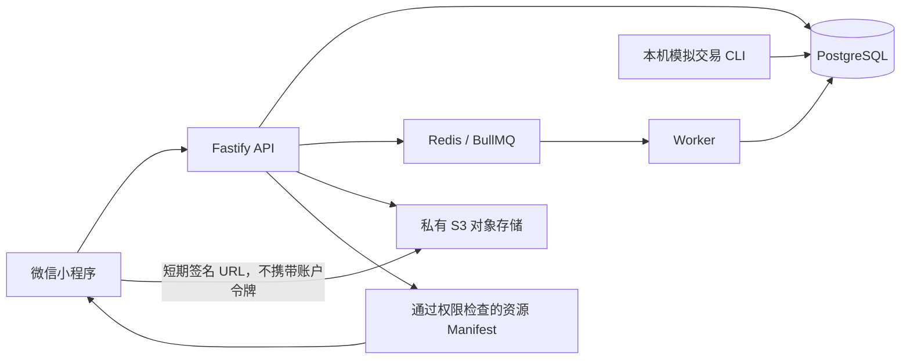
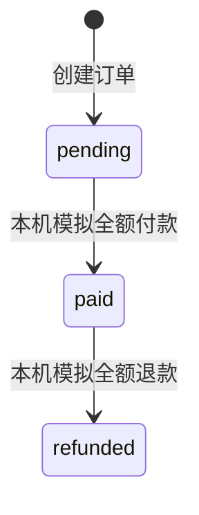

# 听阅小程序：技术架构与需求总览 v5.0

> 更新日期：2026-10-10
> 定位：当前工作区实现与验收快照；取代 v4.0 作为当前阅读入口，保留 v4.0 作为历史记录。
> 状态：内测开发。模拟交易完成本机验收，真实支付与生产上线尚未完成。

## 1. 当前结论

听阅已实现 Peter Rabbit 听读、字幕词卡、生词、Quiz、学习进度、学习积分及账户同步基础。本轮新增本机模拟商品订单、付款、全额退款、固定版本授权和受保护正文读取，并由用户在微信开发者工具模拟器确认付款后可读、退款后无权限。

本文件记录的是本地工作区事实。文档提交到 GitHub 不代表相关实现代码已经全部提交、合并或部署；应以所在分支实际文件和提交记录核对实现。所有模拟付款均不涉及真实资金，不调用 `wx.requestPayment`。

| 项目 | 当前状态 | 证据或边界 |
| --- | --- | --- |
| 客户端 | 原生微信小程序，正式预发布/Demo 两套构建 | 正式包 10 个路由；Demo 功能物理隔离 |
| 内容 | Peter Rabbit 候选听读包 | 322.026 秒音频、59 条字幕、358 个词义、10 道 Quiz；公开商业发布权利门槛未关闭 |
| 同步 | S-01 导入、S-02 进度、S-03 生词本机闭环 | 用户确认已有学习数据保留；不等于生产跨设备验收完成 |
| 积分 | 服务端确认的累计学习积分与排行基础 | 累计无产品上限；客户端不自行证明可信成绩 |
| 手机播放 | 用户确认微信中可播放测试音源 | 不能由此推定后台、锁屏、全部网络或 Safari 均通过；Android 本轮暂不测试 |
| 登录 | 测试界面登录成功 | 本机专用包采用明确的模拟身份；真实微信身份交换尚需独立验收 |
| 模拟收费 | 本机订单、付款、退款、版本权益和正文读取完成 | 仅 local/test，普通构建默认隐藏，公网受限网关不开放交易路由 |
| 真实收费 | 未接入 | 商户、支付、回调、查单、对账、退款及收费内容条件待完成 |
| 发布 | 未正式上线 | 主体/类目、内容权利、稳定部署、隐私及真机验收仍有待办 |

## 2. 技术栈与工具

| 层次 | 实际实现 | 用途 |
| --- | --- | --- |
| 小程序 | JavaScript、WXML、WXSS，微信原生 API | 页面、播放器、学习记录、网络请求和测试正文弹窗 |
| 后端 | TypeScript，Node.js 24+，Fastify 5 | HTTP API、鉴权、内容权限、订单、同步和判题 |
| 数据库 | PostgreSQL 16，`pg` 驱动与 SQL 迁移 | 持久化账户、学习数据、固定版本快照和交易事件 |
| 队列 | Redis、BullMQ，独立 worker | 后台异步任务和积分/排行相关处理 |
| 对象存储 | S3 兼容私有存储，本机 AIStor | 原创测试正文及音频，服务端签发短期资源 URL |
| 契约 | OpenAPI、JSON Schema、示例，`api-contract-v2.1.0` | 客户端与后端接口一致性 |
| 测试 | Node test runner、TypeScript 检查、Playwright/Edge | 单元、隔离数据库集成、浏览器页面与真实本机 API 联调 |
| 原生验证 | 微信开发者工具及 CLI preview | 小程序模板编译、用户人工模拟器验收 |

本机使用 Docker Compose 启动数据库、Redis 和对象存储；临时 HTTPS 隧道只用于已有受限测试，不作为正式服务器。无需 Python 实现本轮交易后端。

## 3. 系统结构与可信边界



账户令牌仅驻留内存；学习本机数据与后端确认结果分开。客户端不能提交可信付款状态、商品金额、任意用户 ID 或自行增加排行积分。后端是订单价格、版本快照、权益和学习结果的判断来源。

本机 API 使用 `127.0.0.1:3100`，PostgreSQL 使用 `55433`，Redis 使用 `56379`，对象存储使用 `59000`。专用本机项目关闭域名校验以供开发者工具模拟器访问；另一台手机不能通过这些 localhost 地址访问服务。普通项目配置不因此放宽。

## 4. 现有学习功能

- Home / Recent / Me 为主要导航；书目、播放器、Quiz 和账户状态提供学习入口。
- 音频采用全局会话，支持暂停续播、跨页保持、断点、倍速及字幕词卡。完成判断依赖自然结束、至少 90% 唯一音频覆盖和尾部 3 秒已听，拖到末尾不能证明完成。
- 生词、学习进度和 Quiz 记录保留本机状态，按约定协议导入或同步；请求具有幂等标识，回执跨账号隔离。
- Me 页展示服务端确认的 Learning Points。BOOKS、WORDS、LISTENING 各有统计口径，不能仅凭其中显示 0 判定全部数据丢失。
- 退款保留学习记录和积分，不删除历史成绩。新增受保护学习写入仍需有效权益。

## 5. 本轮模拟收费实现

### 5.1 数据模型

迁移 `0011_simulated_commerce` 新增内容包快照、购买订单和模拟支付事件；本机数据库已应用 11 条迁移。

| 模型 | 关键约束 |
| --- | --- |
| `content_bundles` | 内容包及版本快照，绑定具体篇目版本与服务端价格 |
| `purchase_orders` | 固定用户、金额、内容和包版本；状态为 pending / paid / refunded |
| `simulated_payment_events` | 唯一事件键，全额金额校验，保存模拟付款/退款历史 |

创建订单使用用户与幂等键的事务锁；同键重试复用结果，换包复用键返回冲突。付款/退款使用事件及订单锁避免并发重复处理。带有订单历史时拒绝回滚迁移，避免删除交易证据。

### 5.2 API 与操作入口

认证接口仅在 local/test 环境注册：`GET /api/v1/bundles`、`GET /api/v1/me/orders`、`GET /api/v1/me/orders/:orderId`、`POST /api/v1/me/orders`。客户端创建请求只含内容包 ID 和版本，幂等键放在请求头。列表和详情只能看到本人订单。

HTTP 不提供模拟付款或退款接口。测试操作者通过 `backend/scripts/simulated-commerce.ts` 执行本机 CLI；脚本拒绝非专用本机数据库。原创测试包 `commerce-test-bundle@1` 为 100 分，正文与 10 秒静音音频单独存储，Peter Rabbit 继续免费。

### 5.3 状态与权益



已退款订单不能再次付款恢复权限；重复旧付款事件也不能复活权益，需要新订单。相同内容版本有另一笔有效付款订单时仍可访问。购买固定 v1 不会自动取得 v2，但在切换当前版本后，已购 v1 可按版本请求；撤下的内容仍拒绝访问。

Manifest、进度、小测、生词等入口检查作品与篇目权限，不能通过将篇目误标免费绕过受限作品。受保护学习写入对订单加共享锁，与退款串行。已确认请求的幂等重放可保留原回执；已有生词删除允许继续操作。

### 5.4 受保护正文阅读

订单下新增“打开测试内容”。每次打开先取得权限校验后的 Manifest，再下载其中的短期签名文本 URL。下载请求不携带账户令牌；目前仅支持大小不超过 64 KiB、未过期的 `text/plain` 资源，不构成完整商业阅读器。

正文仅在页面内存显示，不写入本地存储。关闭、切到后台、退出或切换账户清空正文；请求序号和账户守卫阻止迟到的响应写回页面。退款后重开显示“当前没有有效访问权限”。

资源签名最多有效五分钟。退款能够阻止后续授权，不能收回已经看过、下载或复制的内容，也不能立即撤销尚未过期的旧签名 URL。

## 6. 代码位置

| 路径 | 职责 |
| --- | --- |
| `backend/src/commerce/service.ts` | 内容包、订单、模拟事件及权益查询 |
| `backend/src/commerce/access.ts` | 各内容与学习入口统一权限检查 |
| `backend/src/api/commerce-routes.ts` | 仅 local/test 的认证交易路由 |
| `backend/src/content/service.ts` | 固定版本 Manifest 和 S3 签名 |
| `backend/scripts/commerce-fixture.ts` | 原创测试资源与内容包 |
| `backend/scripts/simulated-commerce.ts` | 本机模拟付款/退款工具 |
| `miniprogram/services/commerce-reader.js` | 无账户凭据的临时正文下载 |
| `miniprogram/ui/controller.js`、`screen.wxml` | 订单页面、复制订单号、权限检查和正文显示 |
| `tools/build-commerce-local-preview.cjs` | primary / isolation 专用本机项目构建 |
| `tools/commerce-local-ui-check.cjs` | 真实本机 API 与 S3 的页面联调 |
| `tests/commerce-ui.test.js` | 重复创建、账号隔离、迟到响应、正文下载测试 |

## 7. 验收证据与限制

2026-10-10 最近一次客户端自动测试为 **120/120 通过**，专用项目路由、原生绑定和 JavaScript/JSON 检查通过；微信开发者工具 preview 编译成功，包总大小 461,839 字节。后端本轮已记录 **60/60** 测试通过，类型检查、契约、密钥扫描及隔离集成结果见专项记录，不能把历史通过视为以后修改无需重测。

隔离数据库脚本验证并发幂等、价格篡改、未付款拦截、跨账号隔离、固定旧版本、退款与多订单权益、历史保留及迁移保护。实际 API/S3 脚本验证付款后下载、退款后 403，受限网关不开放交易接口。浏览器页面桥接使用真实本机 API，订单响应未 mock；它不等于原生自动点击测试。

用户在原生开发者工具模拟器确认过订单付款/退款权限变化，并于本轮截图确认原创正文成功显示。当前人工阅读订单 `54e84d9b-419e-43a2-b1b8-671681043af4` 保持模拟已付款，方便继续查看；自动测试生成的订单通常在结束时退款。订单号只是本机验收索引，不能在其他数据库复用。

原生 Automator 连接曾失败，因此不宣称原生自动化操作全部通过。Android 暂缓，生产跨设备、后台音频、真实身份和实际支付均需另行验收。

## 8. 本机复现

私有环境配置通过本机受忽略的 `backend/.env.device-local` 加载；文件、密码、令牌、网关密钥和数据库导出不得提交仓库。先准备 Docker 依赖、API 与样本，再构建：

```powershell
node tools/build-commerce-local-preview.cjs
node --test tests/*.test.js
node tools/check.js --root=build/commerce-local-primary/miniprogram
```

开发者工具导入 `build/commerce-local-primary`，编译，登录测试账户，Me → 模拟内容包与订单 → 创建订单 → 复制订单号。已有同包待付款订单时页面提示复用，防止连续点击制造重复订单。

```powershell
node --env-file=backend/.env.device-local backend/scripts/simulated-commerce.ts pay ORDER_UUID UNIQUE_PAY_EVENT 100
node --env-file=backend/.env.device-local backend/scripts/simulated-commerce.ts refund ORDER_UUID UNIQUE_REFUND_EVENT 100
```

每次操作后刷新订单；已付款可打开正文，退款后重新打开应被拦截。以上命令从仓库根目录执行，Node 需 24+。生成构建、截图及私有配置不随文档上传。

## 9. 后续开发顺序

1. 完成收费内容、定价、购买范围和服务类目方案；当前主体及支付资格尚未确定，不能直接启用收款。
2. 准备账号持有的稳定 HTTPS 服务与音源，关闭模拟身份替代，验收真实微信登录、会话刷新及跨设备同步。
3. 在既有固定版本权益模型上接真实微信支付：服务端下单、客户端支付、回调验签、查单和幂等确认。不能凭客户端“支付成功”授予权益。
4. 增加真实全额退款、退款状态确认、异常补偿、订单查询及对账；区分成功、处理中、失败和未知状态。
5. 完善正式商品详情、购买说明、订单详情和用户退款路径，再扩展商业阅读器与内容版本运营。
6. 完成内容权利、主体/类目、隐私、部署恢复、iPhone/Android 与网络条件验收，再决定正式发布。

## 10. 相关文档

- [模拟收费验收与操作](docs/模拟收费验收与操作-2026-10-10.md)
- [学习积分验收与交接](docs/学习积分验收与交接-2026-10-10.md)
- [开发进度与待办](开发进度与待办.md)
- [后端实现状态](backend/docs/implementation-status.md)
- [后端契约](backend/contracts/README.md)
- [历史 v4.0](听阅小程序-技术架构与需求总览-v4.0.md)

发生冲突时，优先核对实际代码、测试和明确日期的验收证据；v4.0 关于测试契约、音频失败或模拟交易尚未实现的旧结论，不覆盖本文件的新验收记录。
